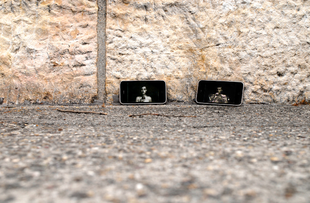

# Adam & Eve

Date: 2005/06/01

Authors: [Saskia Schmidt](http://www.saskiaschmidt.com)

Keywords: adam und eva

MaxWidth: 625px

---
---

The Paradise | Adam and Eve | The Fall of Man
iPhone application | short description
The 2-channel-installation Adam and Eve is now available for the iPhone, leaving its usual, fixed setting. Adam is the counterpart to the application Eve. Together their offer the possibility for synchronised playback over Wi-Fi. But even if Eve isn’t present or there is no wireless connection the 1-channel version is available.

Video installation | short description
“Adam and Eve” is a two channel video installation that works without sound. The video loop contains sequences of black frames that make the viewer find its own perspective about the installation. Only after a while the story is made accessible to the viewer.

2007 10th EpsonFotoFestivalNaarden in the ‘Grote Kerk’ exhibition Paradise in Naarden, Amsterdam, Netherlands.
2005 Kunstfilmbiennale international competition in Cologne, Germany.

<iframe src="http://player.vimeo.com/video/13267354?title=0&amp;byline=0&amp;portrait=0&amp;color=C9ff23" frameborder="0" width="640" height="296"></iframe>
