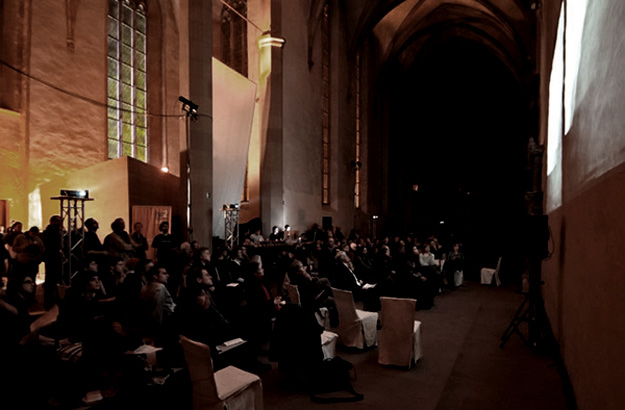
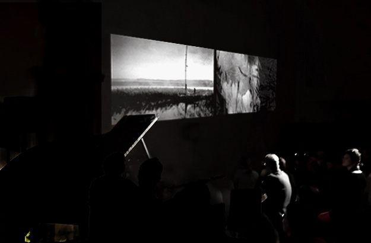
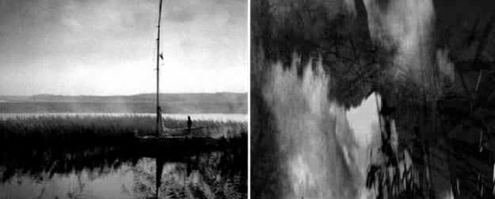
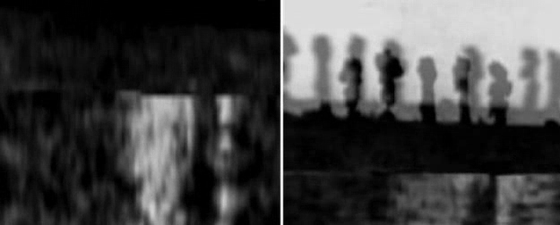

# U-Turn

Date: 2006/02/01

Authors: [Saskia Schmidt](http://www.saskiaschmidt.com)

Keywords: u turn

MaxWidth: 625px

---
---

U-Turn is a project with different operating procedure. The material of the pictures and also the sound were take from the 1962 movie “Knife in the Water (“Noz w wodzie”) by Roman Polanski, his debut feature film. “Noz w wodzie” features only three characters and deals with rivalry and sexual tension on a sailing trip. Everyone knows the words and statements: flashback, Déjà-vu-experience or “it was like a bad dream.” Memories or experiences far in the past or recently happened often appear sketchy and incomplete. In our mind we try to reconsider the situations again and again. We want to experience them again, understand and comprehend them. Forwards, backwards, faster, slower. We go into the details, watch a scene or an image accurately and closely, but we land up again in another picture. Was this belonging to this memory or was this another event from another time period, even a dream? How was it in reality at that time?

An atmosphere supported or tormented by scraps of words and sounds turning impenetrably, sometimes loud, sometimes quiet and barely comprehensible. We twist and turn, rewind our tags of memories again. We spin around in circles. No new knowledge, just an uncomfortable feeling is remaining.

<iframe src="http://player.vimeo.com/video/13274264?title=0&amp;byline=0&amp;portrait=0&amp;color=D9E021" frameborder="0" width="640" height="254"></iframe>
