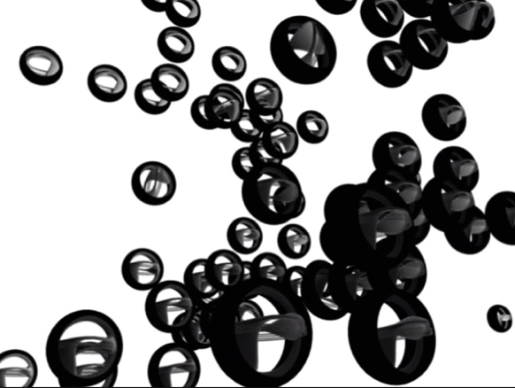
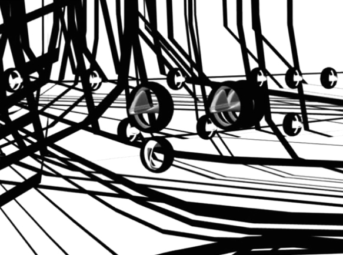
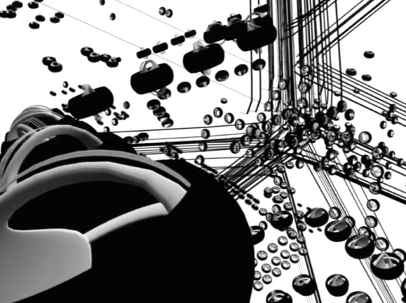
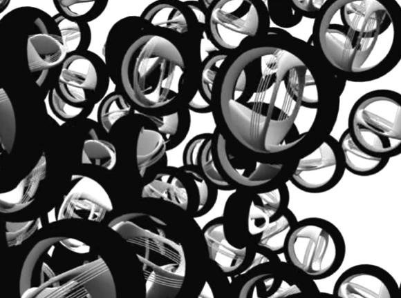

# Multiple Systems

Date: 2006/06/01

Authors: [Martin Böttger](http://tsaworks.com)

Keywords: tsaworks, multiple systems, martin böttger, animation, installation, khk

MaxWidth: 580px

---
---

Constructed dynamics or magnetized voltage - The animation shows moving objects similarity like wheels, in basic structures of mass, crowds, relationships and communication systems. The single object is capture by the group and lose his determination in the amount. The minimalistic sound scape by "Autechre" transmit the special locator’s and bezier curve based movement of the structure. This constant re-formation of the different groups can be observed, density, equality, and rhythm are the basic elements and the ultimate aim of conforming mass.

Video-installation at Rundgang Kassel 2006

<iframe src="http://player.vimeo.com/video/879219?title=0&amp;byline=0&amp;portrait=0&amp;color=c9ff23" frameborder="0" width="640" height="513"></iframe>

