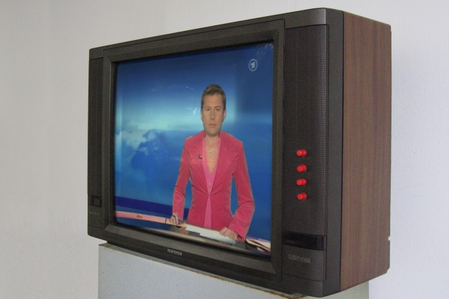
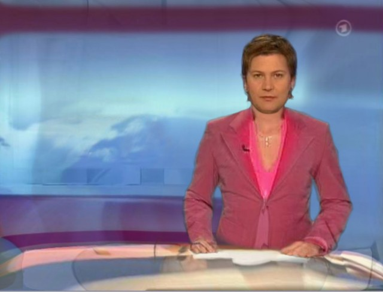

# News

Date: 2006/11/01

Authors: [Felix Böttcher](http://felixboettcher.de/)

MaxWidth: 640px

---
---

Felix Böttcher’s work “news” is presented in unspectacular simplicity: a television as sculpture, with the mute scenery of a female news reader at work frozen there. Image and object contain different time coding. The picture tube of the television balloons out towards the observer like a halved globe and stands as a quote for the German television culture of the 1980s. At the beginning of the era of private television stations the belief in diversity was still intact. The “Tagesschau”, mother of all news broadcasts in the Bundesrepublik, still stands to the present day as the one and only German truth with its unchanging choreography repeated day by day. Over the years more and more news and feature broadcasts have emerged in the television landscape and have sought to develop their own images. Is the same information reappearing again and again experienced differently or made more bearable for viewers through some attractive medial preparation? This question marks the starting point for the scope of Felix Böttcher’s work. Four red knobs of the usual sort on his television allow the viewer to manipulate the medial manner of presentation in exceedingly different ways. Using the controls, the presentation of headlines, the news studio, the sex of the newscaster all can be morphed from one form to another. What emerges is a concretion of absurdities which catapults the actual content of the information into emptiness, until all that one feels is some amusement at the entertainment ...like in real life.

<iframe src="http://player.vimeo.com/video/32789574?title=0&amp;byline=0&amp;portrait=0&amp;color=c9ff23" width="760" height="589" frameborder="0" webkitAllowFullScreen mozallowfullscreen allowFullScreen></iframe>
