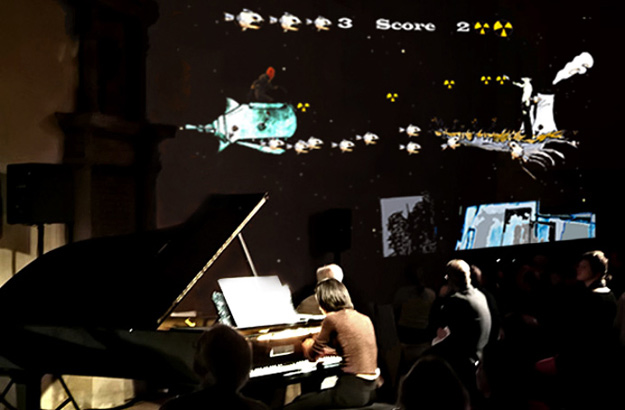
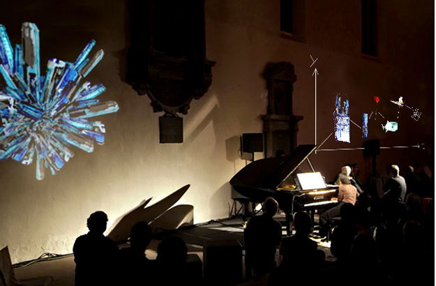
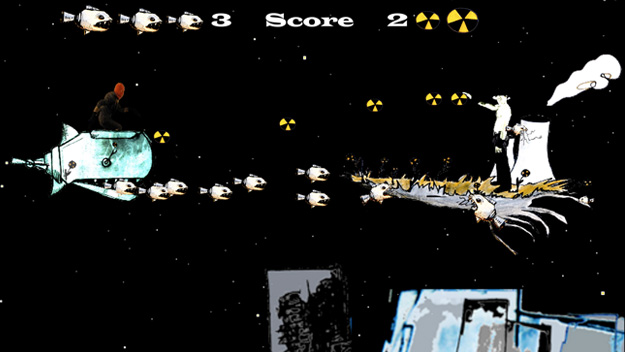

# Palaeologus

Date: 2007/07/01

Authors: [Saskia Schmidt](http://www.saskiaschmidt.com)

Keywords: saskia schmitd, Palaeologus

MaxWidth: 620px

---
---

In 1439 the Byzantine Emperor John Palaeologus an the eight-year-old scholar Gemistus Pletho came from hard-pressed Constantinolple to plead of help against the Moslem Arabs, and initiat debate on the schism between the churches of the East and the West. Pletho gave a vertiginious display of erudition lecturing on Aristotle. The audiance listened with rapt attention, but they were much less happy with his second lecture on Plato and the Neoplatonist Plotinus. Plato was considered a spewer of demons ….“

Chroma – A Book of Colour (1995) von Derek Jarman, p.57

Palaeologus is a video game that was performed in a live situation. It was developed with Alfredo Bautista on an one week workshop for the Music Days in Kassel. The interactive and sound reactive video game was performed during three compositions of classical music by the composer Helmut Lachenmann A children’s game – seven little compositions for piano (1980). It was presented to an audience at the Brüderkirche Kassel.
The pianist Ji-Youn Song backed the video game on the piano. The music defined the course of the game.  
The title “Palaiologos” is symbolically associated with the story from the book Chroma by Derek Jarman. It is the basis for the game.

Picutures of the live performance in the Brüderkirche church at the event Music Days in Kassel Musiktage Kassel.

<iframe src="http://player.vimeo.com/video/13267656?title=0&amp;byline=0&amp;portrait=0&amp;color=c9ff23" frameborder="0" width="640" height="361"></iframe>

