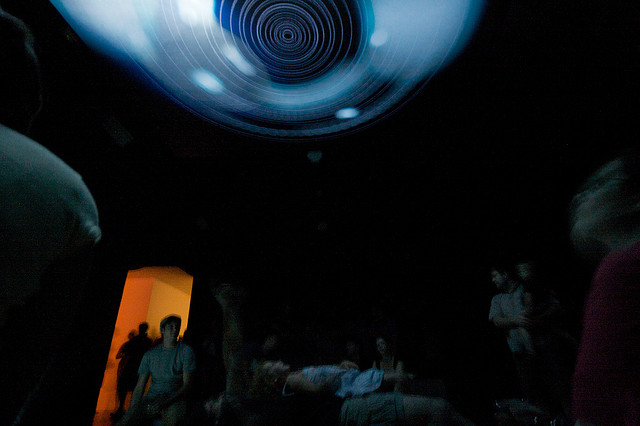
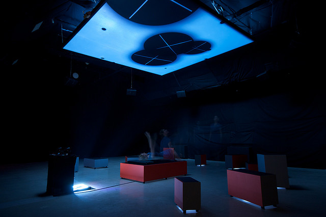
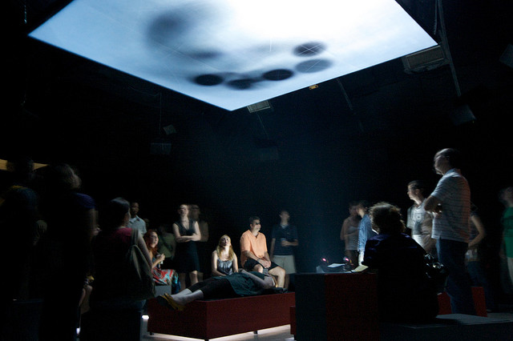

# Orbiter

Date: 2007/09/01

Authors: [Vera-Maria Glahn](http://field.io), [Marcus Wendt](http://field.io)

Keywords: Installation, motion, interactive, tracking, soundtoy, playful

MaxWidth: 640px

---
---

interactive sound environment
installation interactive motion playful soundtoy tracking
The Orbiter takes possession of all senses. It is a place for visitors to lay down and relax, watching the firmament above them. With a small gesture, just pointing upwards, the visitor can insert new stars into orbit with unique visual and musical characteristics. Each version of the Orbiter features various scenes with different graphics, sounds and behaviour. Some create an illusionary nightsky firmament, playing more melodic or ambient sounds. Others experiment with the possibilities of graphical abstraction and rough synths, allowing you to even play drum’n bass-like sounds.

<iframe src="http://player.vimeo.com/video/303105?title=0&amp;byline=0&amp;portrait=0&amp;color=c9ff23" frameborder="0" width="640" height="480"></iframe>

