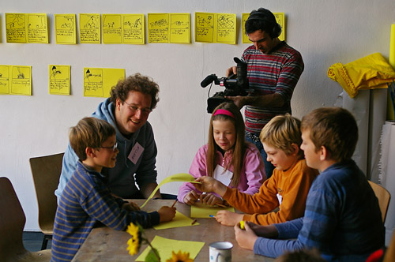
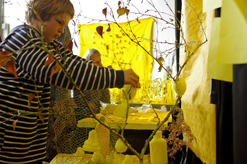
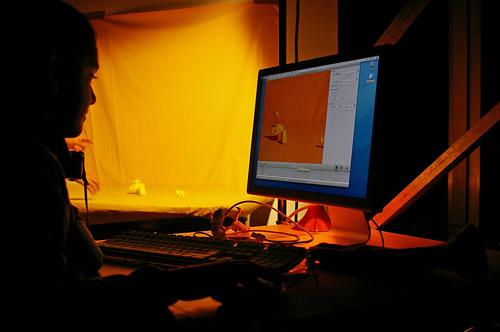

# Sheep’s Journey

Date: 2008/02/01

Authors: [Saskia Schmidt](http://www.saskiaschmidt.com/)

MaxWidth: 500px

---
---

Adventures through the world of colours.

A Sheep’s Journey is for children. It’s here for them to learn the language of design and how to harness their incredibly hard working imaginations. A Sheep’s World is here to teach children the language of design. Working in close cooperation with Saskia Schmidt and their teachers, children will be given a workshop in which they create part of a film that involves building up a story from the theme right through to completing the animation. Each workshop is a new episode in the life of a little white sheep who has gone on an adventure to see every single colour in the world.

Please check out <a href="http://www.sheepsjourney.com/" target="_blank">Sheep’s Journey Website </a>and the <a href="http://vimeo.com/channels/sheepsjourney" target="_blank">Sheep’s Journey Video Channel</a> for more information!

<iframe src="http://player.vimeo.com/video/13269412?title=0&amp;byline=0&amp;portrait=0&amp;color=c9ff23" frameborder="0" width="640" height="360"></iframe>

<iframe src="http://player.vimeo.com/video/13269780?title=0&amp;byline=0&amp;portrait=0&amp;color=c9ff23" frameborder="0" width="640" height="360"></iframe>
