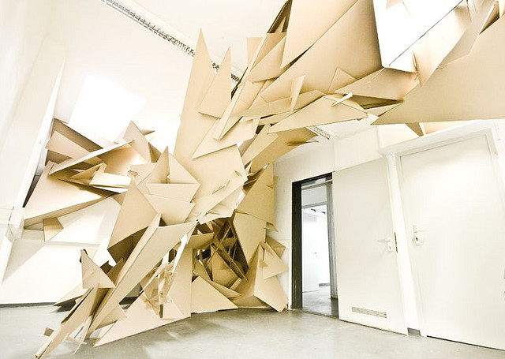

# Cluster

Date: 2008/07/01

Authors: [Martin Böttger](http://www.tsaworks.com/)

MaxWidth: 640px

---
---

Cluster is a try to explore the border between 3d graphics and real shapes. The structure is based on a computer generated shape. Triangles in different variations and size are the fundamentals of the hole construction.

Size: 5x5x3m cardboard

