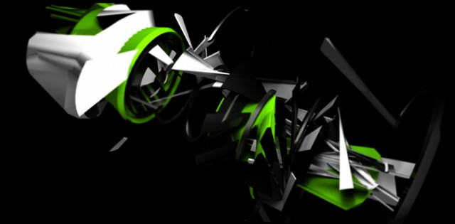

# Tractor

Date: 2008/07/01

Authors: [Martin Böttger](http://www.tsaworks.com/)

MaxWidth: 640px

---
---

The Tractor name comes from the usually used term for agricultural machines. The visual object on the screen is representative of the axis of a tractor engine. The center of the engine axis. The audiovisual narrative in place characterizes the behavior cycle of Tractor which can be metaphorically compared to the behavior of a Wasp, thus assuming it’s organic and non-linear changes in speed, rotation and movement. This non-linear behavior is shown by the visual deformations that Tractor assumes along the 3:30 minutes. The sound is being used to drive the narrative. It’s not only representative of what is visually happening in scene but also suggestive of what is happening inside Tractor, in areas that are not visually “open” to the viewer such as the central cylinder of the object (or the Wasps heart). I t progresses from an atmospheric sound scape that sets the “mood” in first part of the visual piece to a second moment where the extreme sync takes place representing what is visually going on. The extreme contrast between different shapes and forms reveals what Tractor is in it’s essence: a spatial and temporal distortion machine.

---

Joined onedotzero 08 / Nemo Film Festival Paris 09 / Fete-anim Festival Lille 09 / Ditto event 16 MAY UK 09 sound-design BRUNO DIAS animaton <a href="http://www.tsaworks.com">tsaworks.com</a>

<iframe src="http://player.vimeo.com/video/1351285?title=0&amp;byline=0&amp;portrait=0&amp;color=D9E021" frameborder="0" width="640" height="269"></iframe>

