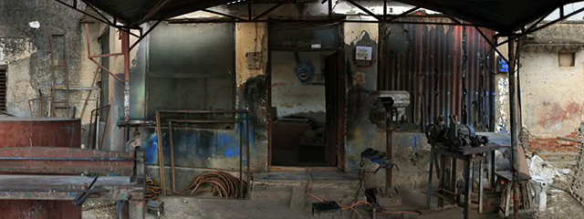
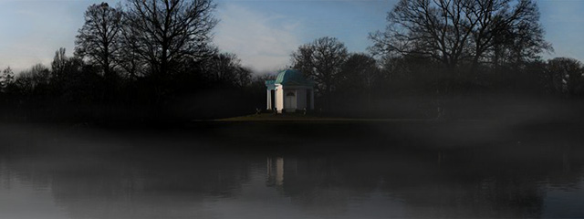

# Parallax Photography

Date: 2008/10/01

Authors: [Valentin Dietmar](http://valentindietmar.com)

MaxWidth: 640px

---
---

Animated photo layers - put into a parallactic system - create the illusion of movement in a three-dimensional room. Based on these works, the interactive music video clip 'collective suicide' emerged. The four examples shown here are built around pictures which were taken in India, Venezuela and Germany.

