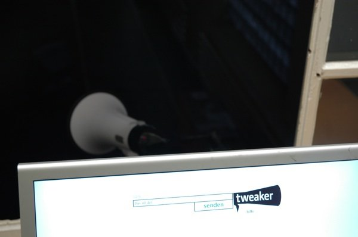
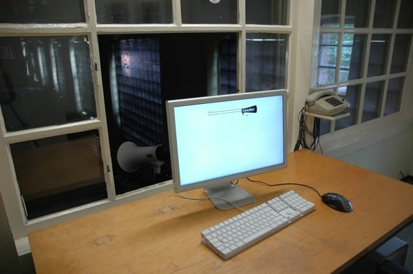
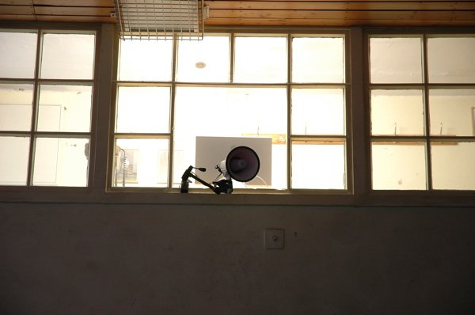

# Tweaker

Date: 2009/01/01

Authors: [Tobias Hellwig](http://tobiashellwig.de)

MaxWidth: 600px

---
---

_„Wie man in die Welt twittert, so schallt es wieder heraus“_ Tweaker materialisiert virtuelle Textbotschaften zu Sound. Er spricht aus, was andere denken und erweitert die Internetkommunikation um eine sinnliche Nuance. Tweaker ist eine Wortschöpfung aus den Begriffen Twitter und Speaker. Damit benennt der Titel zugleich Herkunft und Funktion der Arbeit.

Tweaker ist Teil des sozialen Netzwerks Twitter. Dieses basiert auf dem Prinzip des Micro-Blogs: Nur 140 Zeichen stehen jedem Mitglied für eine einzelne Botschaft, einen tweet, an die eigenen Follower zur Verfügung. Der Output ist beschränkt, doch in der Kürze liegt die Würze: Mit über  neun Millionen Usern erfreut sich der Service eines stetig wachsenden Zulaufs. Das Potenzial der kurzen, weitgestreuten Nachrichten wurde schnell erkannt: Auch Britney Spears und Sarah Palin u.a. nutzen die Plattform für ihre Zwecke. Längst ist Twitter jedoch über belangloses Gezwitscher hinausgewachsen. Während der Wahlen im Iran wurde die Internet-Community zu einem starken Sprachrohr und wichtigen Portal für unzensierte Berichterstattung.

Der Speaker verbindet den virtuellen Twitter-Teil der Arbeit mit dem Hier und Jetzt. An Ort und Stelle spricht Tweaker erhaltene Nachrichten aus. Dabei können die tweets von überall her über Twitter an Tweaker gesendet werden oder über das Interface der Arbeit am Standort eingegeben  werden. Jede Botschaft an Tweaker findet Gehör – und wird vom Lautsprecher in die Umgebung hinausposaunt. Von der neuesten Schlagzeile über den Status der eigenen Befindlichkeit – Tweaker spricht aus, was man ihm vorgibt, ohne Auswahl und Zensur.

Sätze sprudeln durch die Luft:  
_„Afghanistan bomb targets police, kills 12“_ (<a href="http://www.twitter.com/cnn">@cnn</a> via Twitter);  
_„a busy sunny early morning! hello!“_ (<a href="http://www.twitter.com/veraglahn">@veraglahn</a> via Twitter);  
_„Die Rechtschreibung kennt "Britney Spears", aber nicht "Sarah Palin"“_ (<a href="http://www.twitter.com/synecstasy">@synecstasy</a> via
Twitter).

Dabei offenbart Tweaker ein Wesensmerkmal von Twitter: Der Kommunikationspfeil der tweets zeigt stets in nur eine Richtung. Twittern ist in erster Linie Erzählen, in zweiter Instanz Zuhören, aber nur in den seltensten Fällen Antworten. Und so ruft auch Tweaker in die Welt hinaus, ohne auf eine Antwort zu hoffen. Die Interaktion der Arbeit endet mit dem Ausrufen der Botschaft. Die akustische Aufnahme erweitert zwar die virtuelle Kommunikation um eine sinnliche Komponente. Gleichzeitig jedoch spiegelt Tweaker, über die eigene technische Seite hinausweisend, die sich rasant wandelnden Nuancen zwischenmenschlicher Kommunikation in Zeiten des Internets wider.

