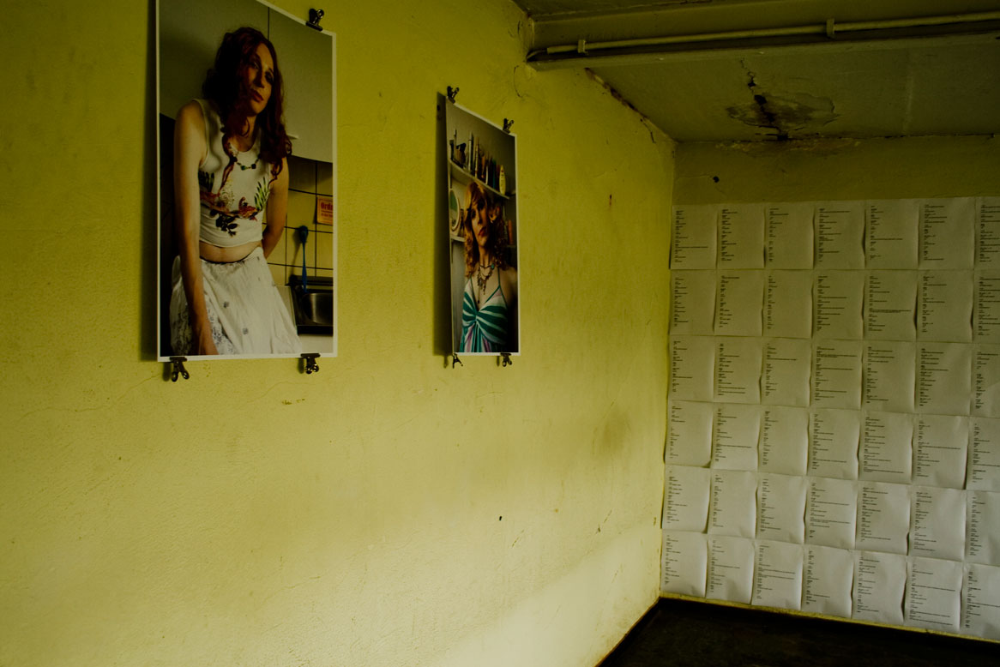
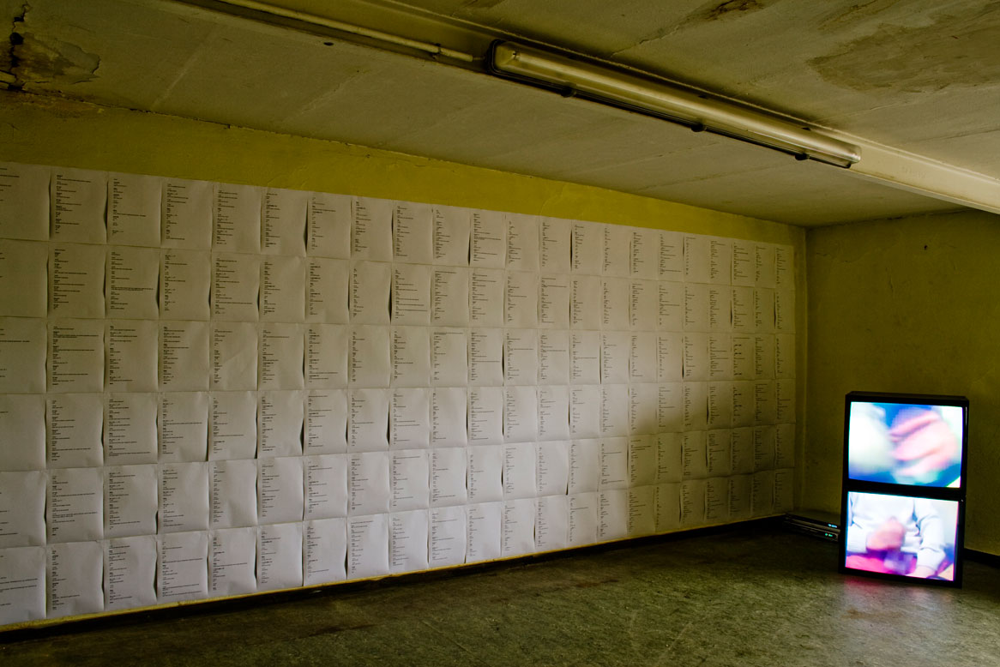
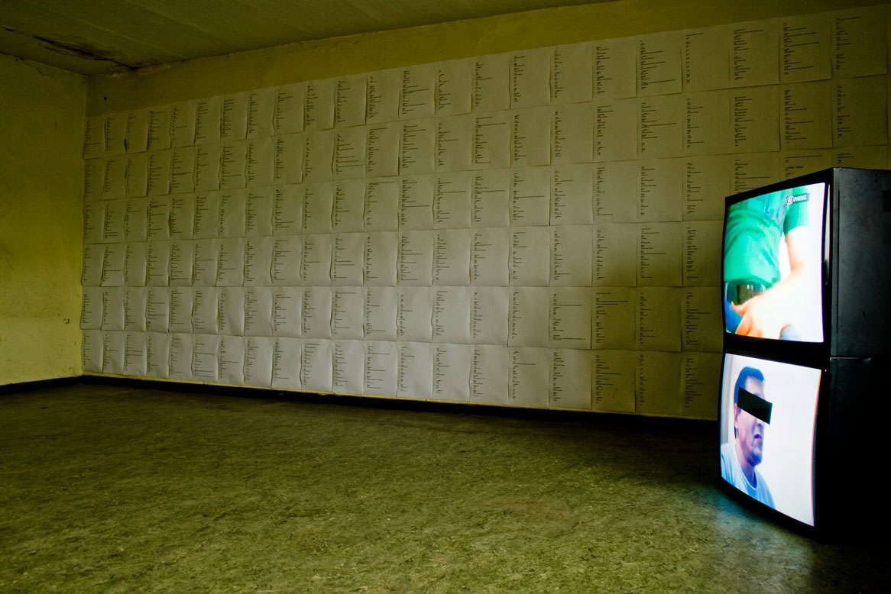
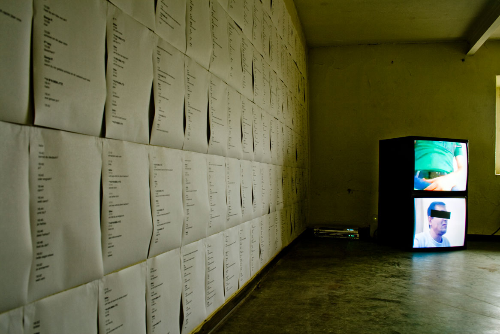
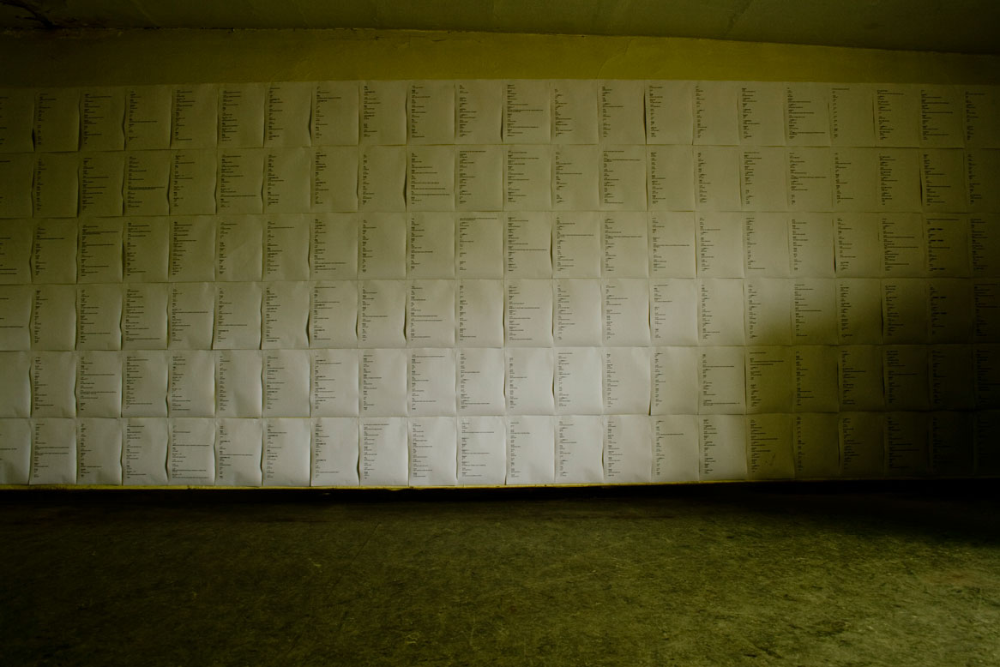
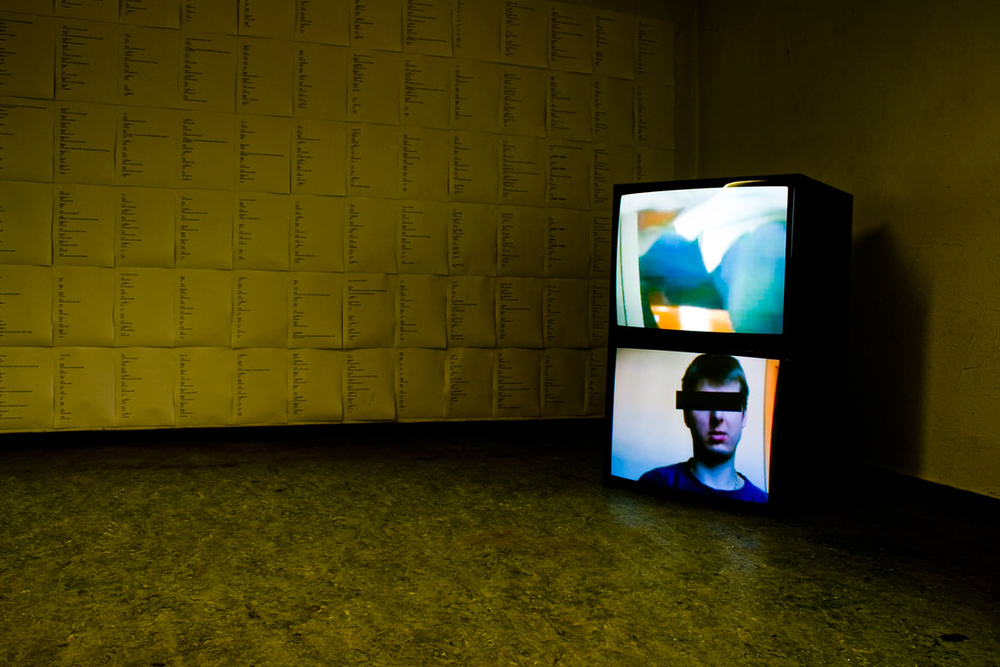
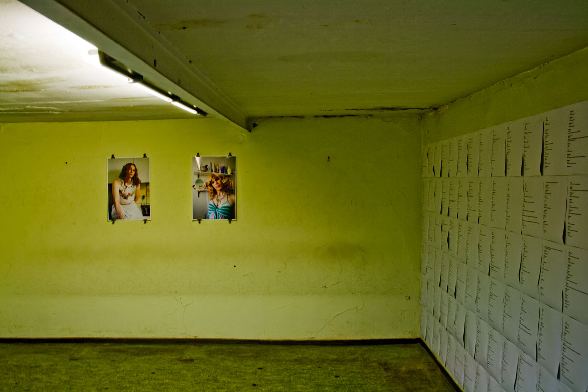
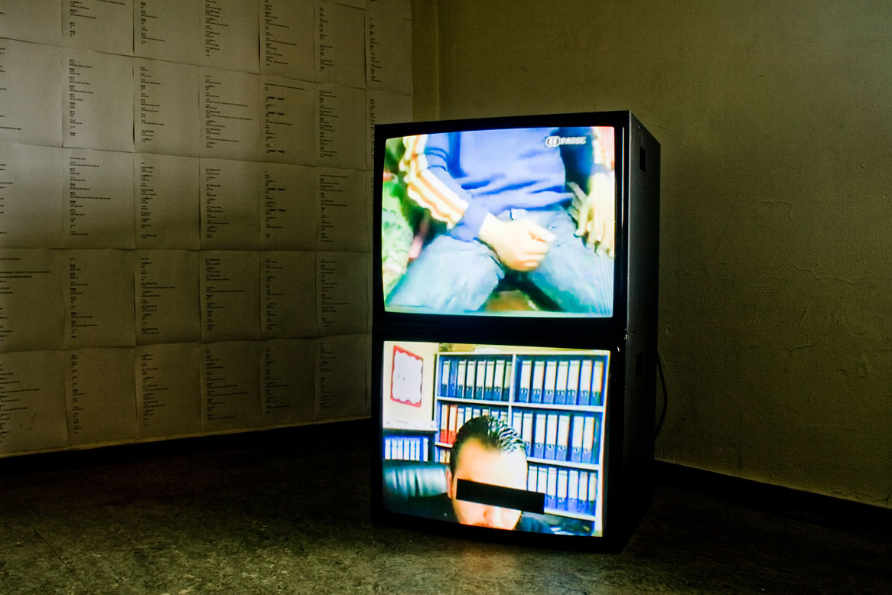
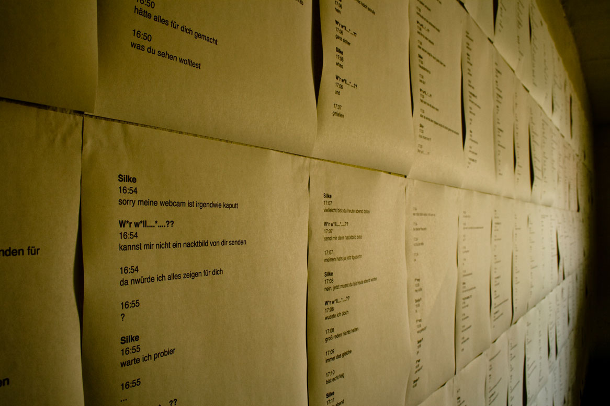

# SkypeMe!

Date: 2009/07/01

Authors: [Kim Asendorf](http://kimasendorf.com), [Philipp Teister](http://localdataeatsthemachine.com/)

Keywords: net.art, Social study, Performance

---
---

Social anonymity in interaction systems. Communication via the computer or more precisely the Internet is basically a usual conversation. Actually it is really common for a big count of people. This kind of communication becomes, especially for many young people, an integral part of their life. Although you talk with friends as if they are exactly in the same location as you, you feel completly alone in conversations with strangers. It is amazing how intimacy personal data is given up on the Internet and how the inhibition is falling by the separation by computers. Apparently there exists the belief, somewhere in the people, that the ones with whom they are talking through the computer, are not real.
Otherwise, and that is the contradictory, people want to believe what they get prefixed.

We, that means Philipp Teister and me, investigated this statement on the lead of Skype. We created a character of a twenty years old girl for each of us: Silke and Sonja. Then we brought them to Skype. The idea behind that was to collect all incomming data to evaluate it at the end. We never opened the mic or the cam, we just used the keyboard to get in touch with all the strangers.

We put the results together to a room-installation, consisting of a wall full of chatlogs, two monitors with the recorded videos and to pictures of ourself disguises as Silke and Sonja, which should show how easy it is to be someone else on the Internet. Basically we can say each guy who called us wanted to fuck with us.

## Downloads

The Skype chat protocols as PDF (Principal German)  
[http://kimasendorf.com/skypeme/skypeme_chatprotocol.pdf](http://kimasendorf.com/skypeme/skypeme_chatprotocol.pdf)

