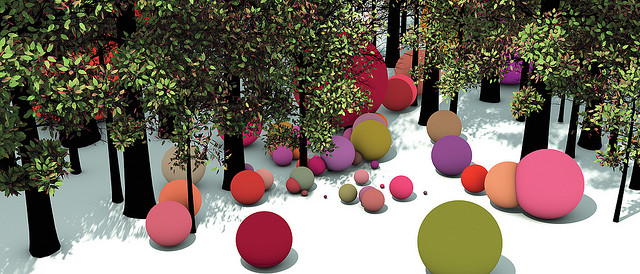
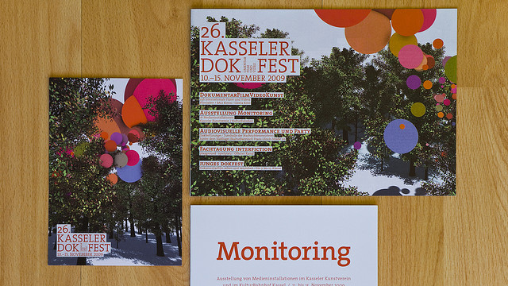
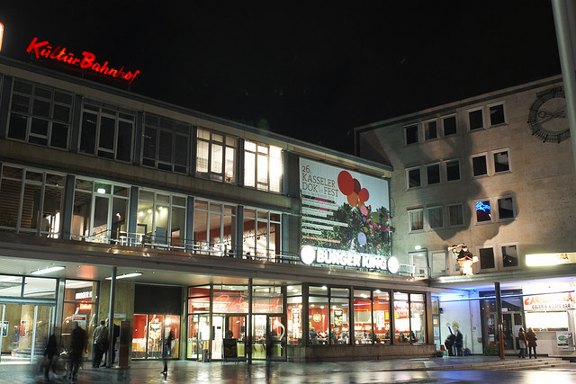
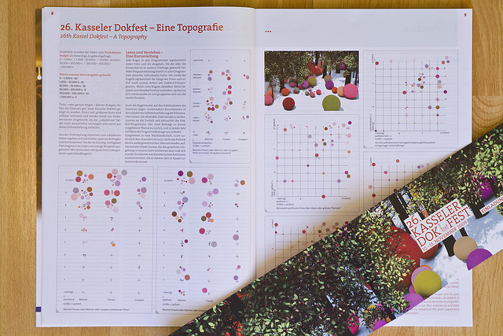

# Dokfest Forest

Date: 2009/11/01

Authors: [Vera-Maria Glahn](http://field.io), [Marcus Wendt](http://field.io)

MaxWidth: 640px

---
---

For the 26th edition of the Kassel Documentary Film and Video Festival, FIELD designed an identity based on the festival’s film submission database. Set in a thick and obscure forest like the wooded surroundings of Kassel, the colourful spheres form a sculptural representation of the programme – each of them represents a film, video, or installation work shown at the festival.

