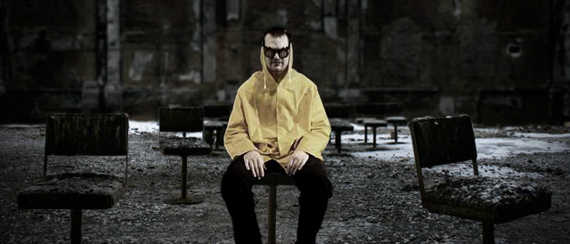

# Collective Suicide

Date: 2010/10/01
Authors: [Valentin Dietmar](http://valentindietmar.com)
MaxWidth: 640px

---
---

Interactive music video clip modeled after an adventure video game, consisting of a combination of photos and videos which are movably implemented in a parallactic system and thus create the illusion of a three-dimensional room. This point-and-click video prompts it’s viewer into leaving the classical, passive role of a music video consumer. The viewer builds a mental bridge with the musician by taking control of him and thereby is able to get a more intense experience compared to regular, more linear music videos.

[Collective Suicide](http://valentindietmar.com/subdomains/collectivesuicide/index_cs.html)