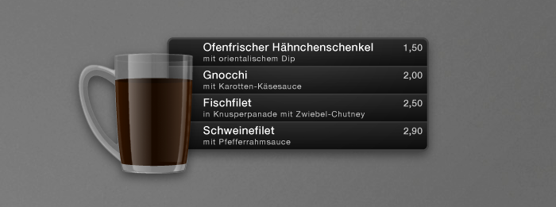

# Mensa Widget

Date: 2010/12/01
Authors: Gerard Delmàs
MaxWidth: 700px

---
---

Mac OS X, das Apple-Betriebssystem, zeigt auf seinem „Dashboard“ (auf Deutsch etwa „Armaturenbrett“) eine Sammlung von Werkzeugen, sogenannte „Widgets“, die dem Computernutzer jederzeit zu Diensten sein sollen. So finden sich dort etwa Uhren, Kalender, Wettervorhersagen oder Flugpläne. Charakteristisch für solche Widgets sind ihre reduzierte, klare Gestaltung und ihre Konzentration auf möglichst eine einzige, eng umgrenzte Funktion. Wie die Anzeigen auf dem Armaturenbrett eines Autos sollen sie schnell und einfach erfassbar sein.

Gerard Delmàs’ Mensa Widget steht mit seinen klaren Formen in dieser Tradition, geht aber auch über sie hinaus, ohne dabei jedoch den Bereich des angewandten Designs zu verlassen.

Das Widget zeigt die aktuelle Speisekarte der Mensa der Kunsthochschule Kassel. Die Daten dafür bereitet ein Server automatisiert auf. Dieser Server bezieht seine Daten wiederum von der Webseite des Studentenwerks. Es unterscheidet dabei Hauptspeise und Beilage und stellt sie in unterschiedlichen Schriftgrößen dar. Auf diese Weise erreicht das Widget eine klare und zugleich Platz sparende Übersichtlichkeit.

Die Gestaltung des Widgets fügt sich ästhetisch in seine Umgebung, das Mac OS-Betriebssystem, ein. Sie verzichtet dabei aber nicht auf funktionale Schönheit. Die Tasse, deren Form und Materialiät an die Tassen des Kasseler Studentenwerks angelehnt ist, macht das Widget einfach auffindbar. Der Kaffee-Füllstand zeigt auf den ersten Blick, wie lange die Mensa noch geöffnet ist. Er sinkt langsam ab – die Tasse ist leer, wenn die Mensa geschlossen ist.

Die Grundlagen zum Erweitern des Widgets auf weitere Mensen sind bereits gelegt.

Wie bei einem guten Widget üblich, ist es nach der ersten Einrichtung nicht nötig, irgendwelche Eingaben zu tätigen oder das Programm im eigentlichen Sinne des Wortes zu „bedienen“. Es steht stattdessen jederzeit für einen kurzen Blick bereit.

Frei verfügbar auf [www.mensa-widget.de](http://www.mensa-widget.de).

_Text: Marian Stiehler_