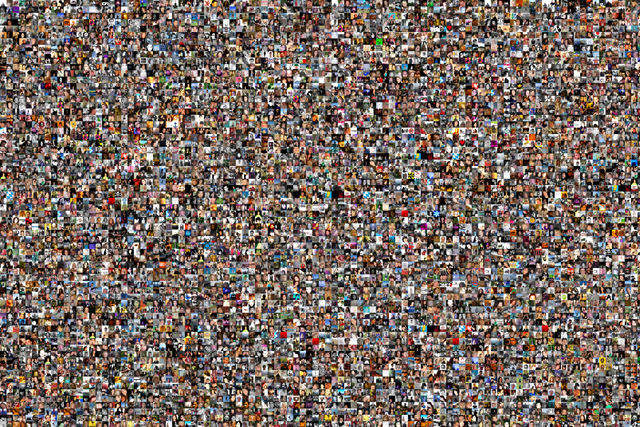
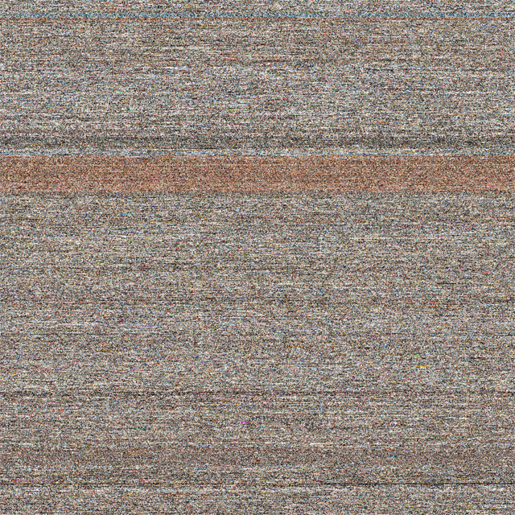
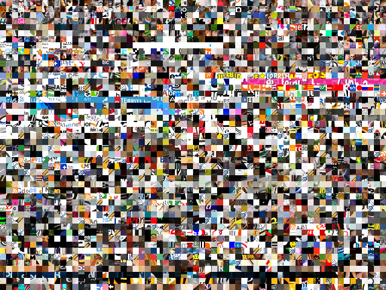
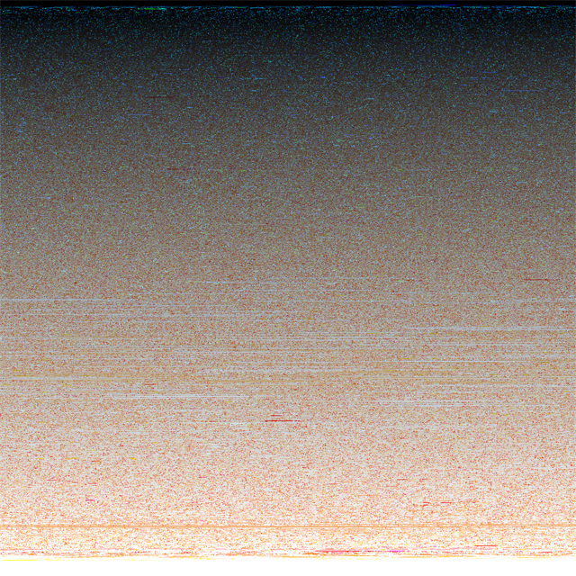
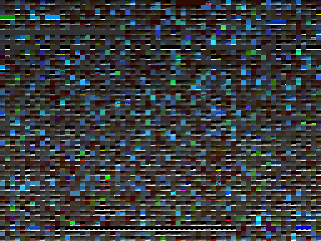

# 100.000.000 stolen pixels

Date: 2010/12/01
Authors: [Kim Asendorf](http://kimasendorf.com)
MaxWidth: 640px

---
---

A web crawler started with 10 URLs (See first 10 in url.log) and searched HTML pages for images and hyperlinks. Each found image got downloaded and 100 pixels in a square of 10×10 were cut out of it. Each found hyperlink got stored in the cache and thereby added to the list of searchable URLs. The process repeated itself until 1.000.000 images were downloaded and 100.000.000 pixels were stolen. The application run for 215:30 hours (9 days).

[kimasendorf.com/100000000](http://kimasendorf.com/100000000/)

