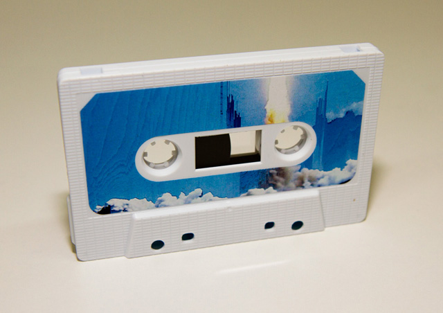
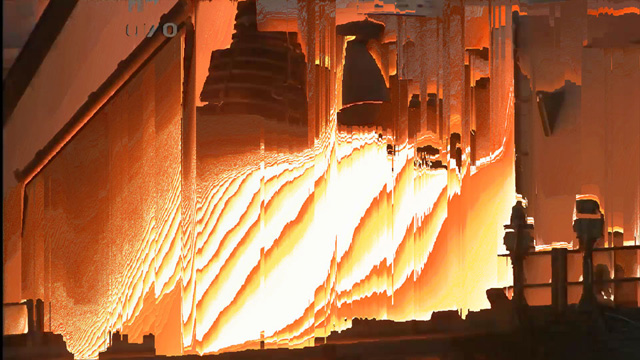

# Supreme Sunlight

Date: 2011/01/01
Authors: [Kim Asendorf](http://kimasendorf.com)
MaxWidth: 640px

---
---

<iframe src="http://player.vimeo.com/video/16800870?title=0&amp;byline=0&amp;portrait=0&amp;color=D9E021" frameborder="0" height="360" width="640"></iframe>

Supreme Sunlight is a track from a.d.l.r.’s (Nicholas Morera) debut album “Foam on the waves of space-time”, released a few weeks ago on [Non Projects](http://nonprojects.net), Los Angeles.

I got asked by Atley G. Kasky, one of the curators from [but does it float](http://butdoesitfloat.com) and design director for Non Projects, to do a cover artwork for a tape. The complete thing evolved into a experimental glitch video achieved with [pixel sorting](http://kimasendorf.com/mountain-tour/)

The tape was limited to 100 copies and is sold out. But the binary version is still available on [iTunes](href="http://itunes.apple.com/us/album/foam-on-the-waves-of-space-time/id411598959).

HD Video, please watch in fullscreen on [Vimeo](http://vimeo.com/16800870)!

- [Non Projects](http://nonprojects.net)
- [Nicholas Morera](http://soundcloud.com/adlrtaperecordings)
- [Vimeo page](http://vimeo.com/16800870)
- [Flickr set](http://www.flickr.com/photos/kimasendorf/sets/72157625909700560/)

