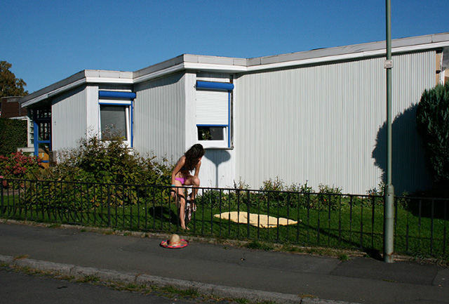

# Frontyardholidays

Date: 2011/04/01
Authors: [Valentin Dietmar](http://valentindietmar.com)
MaxWidth: 640px

---
---

The meaning of holiday is always closely linked to relaxation in a peaceful environment. Even though the most beautiful holiday location is a different one in every person's mind, the aim is always the same: to relax. But is it necessary to go far away from home to reach this aim? Or can we enjoy holidays in our environment close by? The frontyardholidays project aims to ask these questions with a little irony. The artists pick front gardens from people they do not know and enter these sometimes bordered areas. To show the usability of the gardens photos of re-enacted holiday scenes are taken. Printed postcards are sent to the residents of houses the front gardens belong to.

[www.frontyardholidays.com](http://www.frontyardholidays.com)