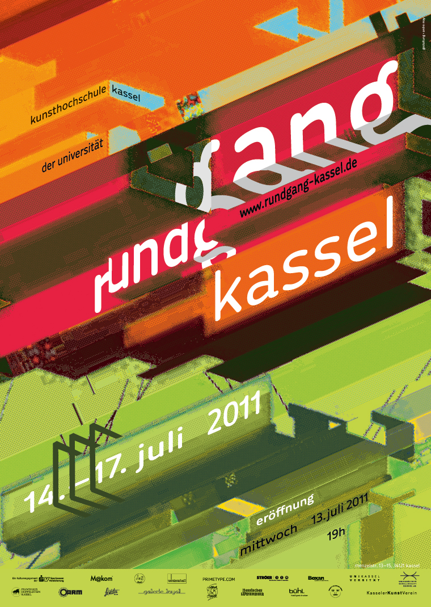

# rundgang2011

Date: 2011/03/01
Authors: Ann-Kathrin Brandt, [Andre May](http://andre-may.com), [Jonathan Pirnay](http://johnnycrab.com), [Jörn Röder](http://joernroeder.de)

---
---

“Rundgang” is the annual exhibition of the School of Art and Design Kassel.

The concept of _rundgang2011_ is to interpret and visualise the school’s open learning structure and its architecture. This is emphasised by an online art catalogue which opens up the possibility to students of uploading and connecting their works, resulting in a close network of art within which each work is treated equally.

In addition to the printable version (available for order on [Amazon](http://www.amazon.de/www-rundgang-kassel-katalog-printversion-Bernhard-Balkenhol/dp/3842370423/ref=sr_1_2?ie=UTF8&qid=1328571283&sr=8-2)) users can click their way to their own catalogue, download it as a pdf-file and have it printed directly at the exhibition.

