# Maps

Date: 01/05/2011
Authors: [Kim Asendorf](http://kimasendorf.com), [Jörn Röder](http://joernroeder.de)
MaxWidth: 520
Keywords: maps, topographic, processing, generator

---
---

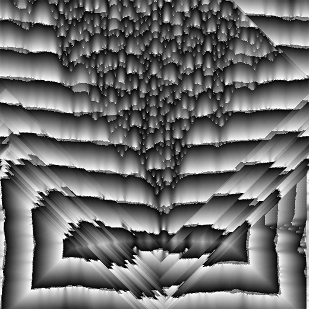

Maps, the most objective way to describe something, an abstraction as close as possible to the real. There are so many types of maps, basically for special usage, but also universal maps, some are stylized or designed, some are just raw and technical. Maps are famous for many reasons, they help you to orientate, they are easy to read and to understand, and they are just beautiful.

Our base idea is to generate the earth, another earth, a possible variation of our planet. They want it as detailed as much, so we started with the details. The main property of each landscape is the vertical drop. Everything else in this landscape depends on it, rivers and waters, forests and meadows. Civilizations and their borders are build on the nature and particular every urbanity. So 'height maps', topographical maps, are the basis.

We started with a simple bezier spline, build on some random points. These spline gets drawn with a black and white noise gradient somewhere in the map, and marks the highest points. Secondly we experimented with some cellular automata strategies to fill the map from the peak on. The result are exciting, and they pushed us into both directions, the height map and the chaos direction.

---

## Beauty of madness

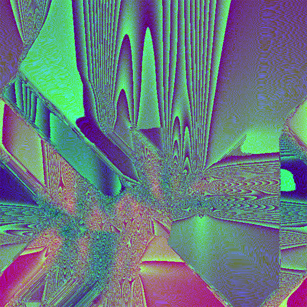
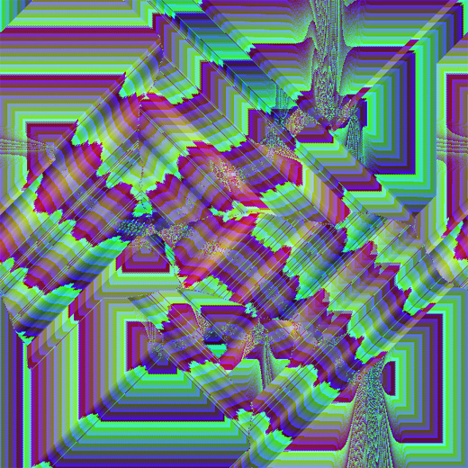
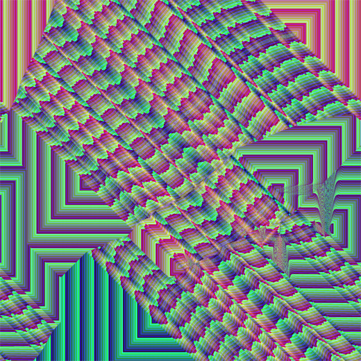
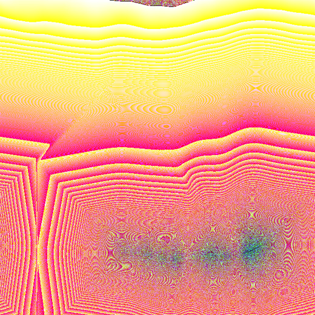
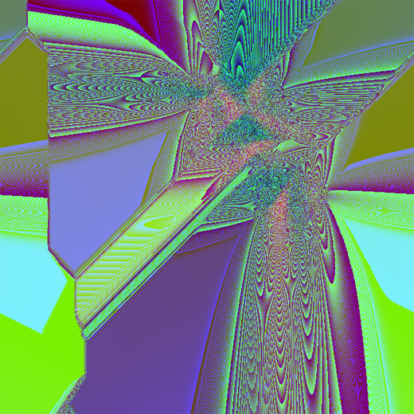
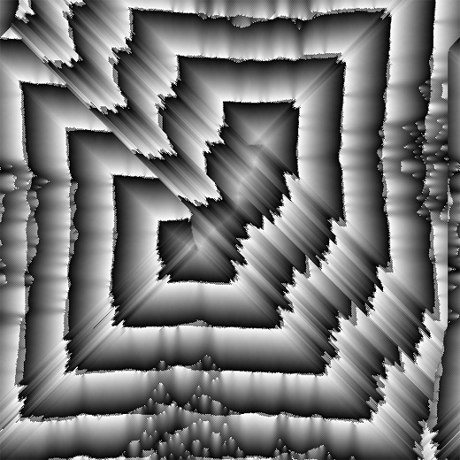

## Automata test test

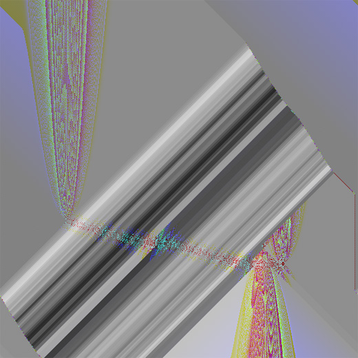
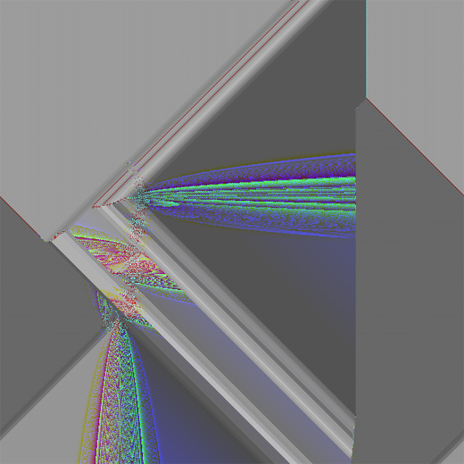
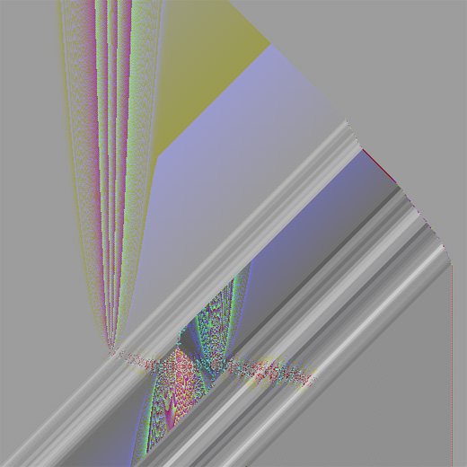
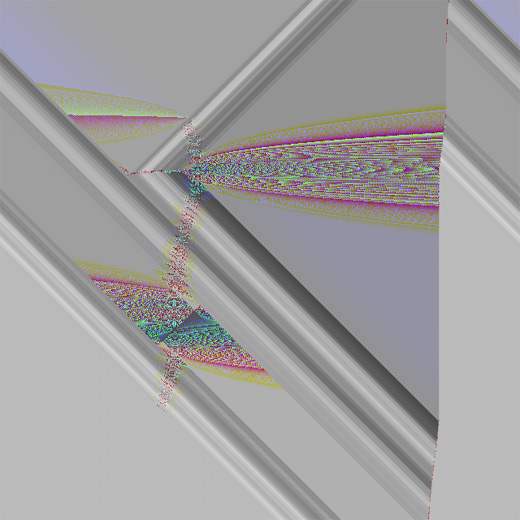
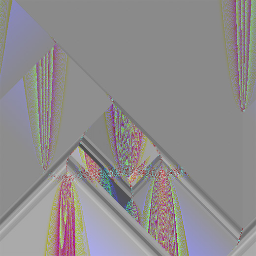
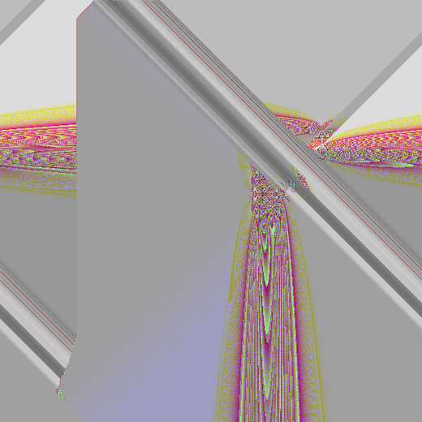
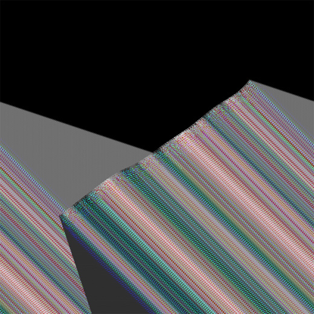
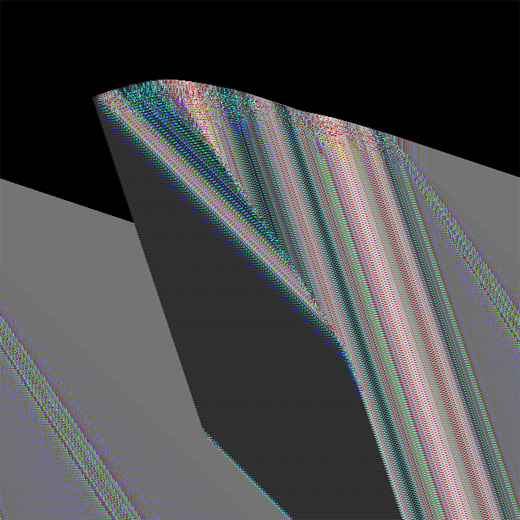

## Monochrome desert

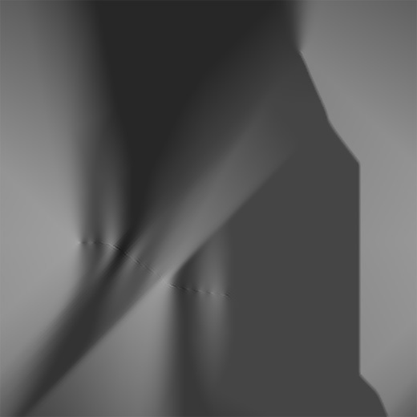
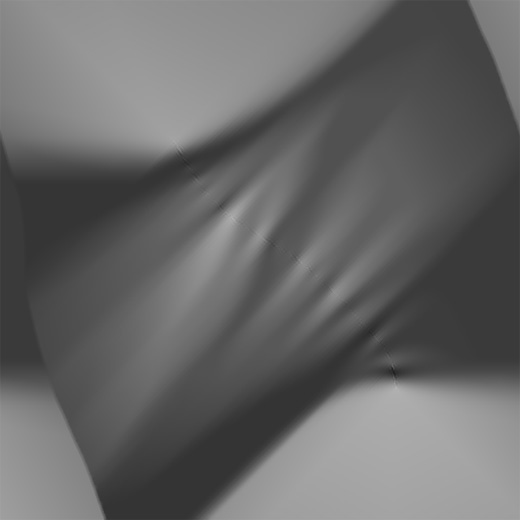
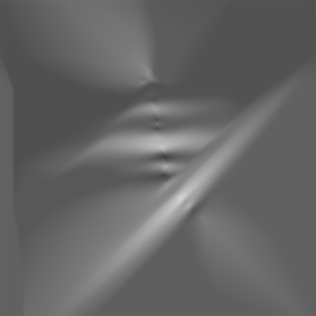
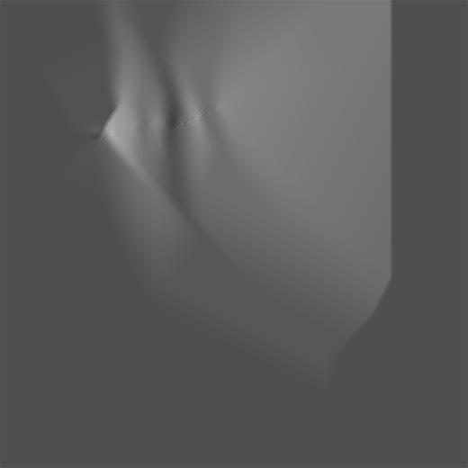
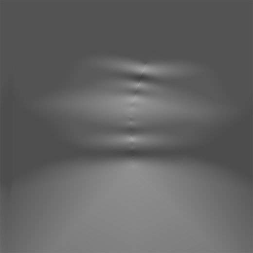

## Pixel-topo

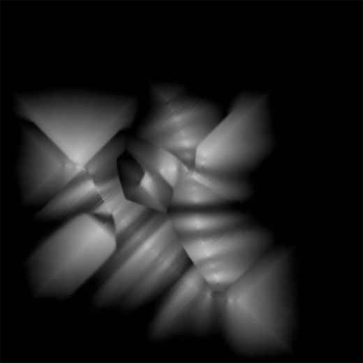
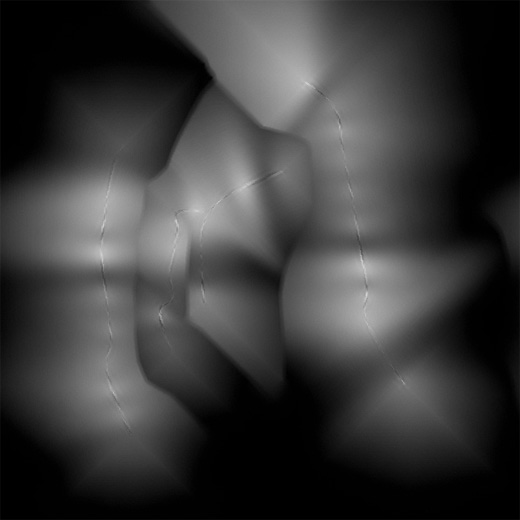
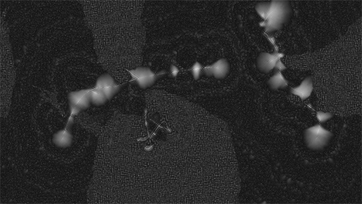
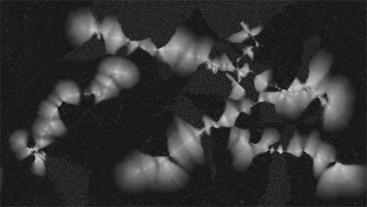
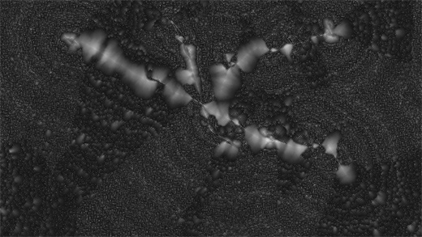
