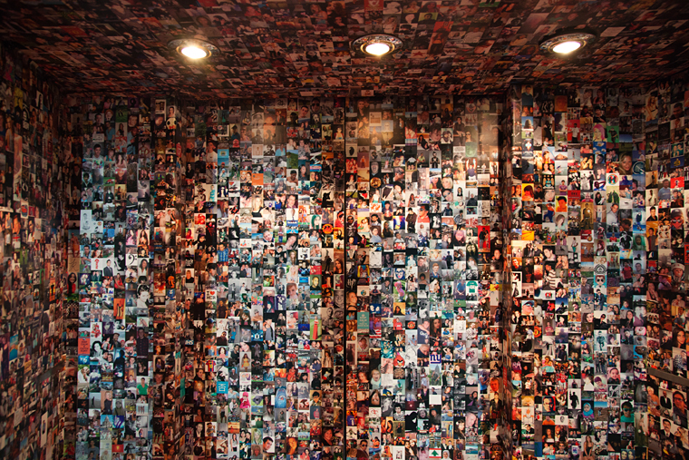

# fbFaces

Date: 01/06/2011
Keywords: installation, facebook, profile image, wallpaper
Authors: [Jonathan Pirnay](http://johnnycrab.com), [Jörn Röder](http://joernroeder.de)

---
---

»fbFaces« is a project that deals with the issue of data accessibility on the Internet; a topic that is gaining more and more importance and actuality – especially in our times of privacy protection and social networks. On the one hand »Internet giants« like Google etc. are coming under criticism for unsolicitedly collecting any information accessible, on the other hand it is surprising how many intimacies we reveal voluntarily, especially in social networks like facebook.

»fbFaces« is a facebook crawler, built using JavaScript & PHP, that starts at the public profile of any fb-user, saving profile image, facebook-ID and name, and afterwards continuing its way to the public profiles of the user's friends. And so on…

An unimaginable flood of images with self-projection as its only purpose.

100.000 of these profile images were used (via Processing) to print a wallpaper for an entire room.

fbFaces is an attempt to visualize the incredible amount of data and images that we are daily overwhelmed by, so that we can neither realize our own selectivity nor consider the amount of data perceived.

The wallpaper transforms the room itself into a flood of information. It surrounds us, cannot be estimated from distance; details can only be caught through determined selection.

But then they vanish again – in a cloud of information.

---

_»fbFaces« has been exhibited at [Alpha-ville](http://www.alpha-ville.co.uk/fbfaces), London.
In 2012, a variation of fbFaces has been exhibited in an elevator at the Museum of Science and Industry, Manchester within the context of [FutureEverything 2012](http://2012.futureeverything.org/art/joern-roeder-jonathan-pirnay-fbfaces)._

_[Interview in iGNANT magazine (in German)](http://www.ignant.de/2011/10/26/interview-facebook-faces/)_

----

