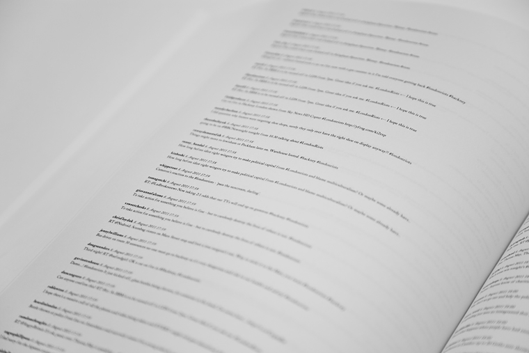
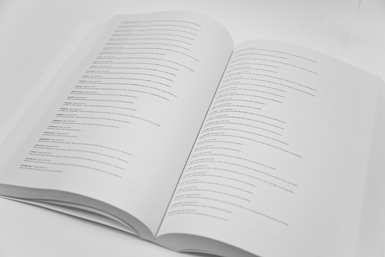
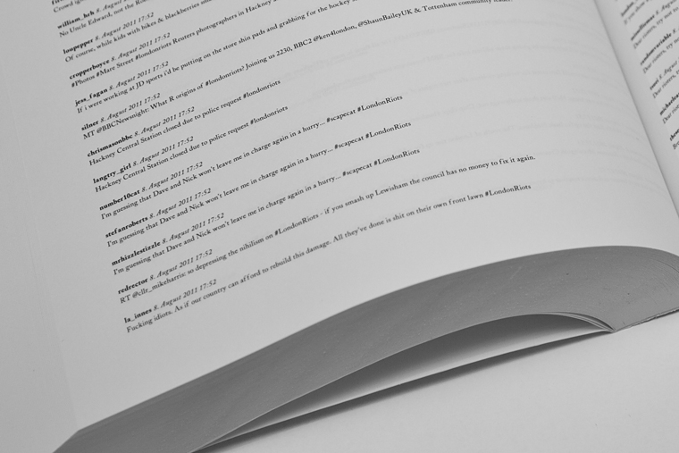
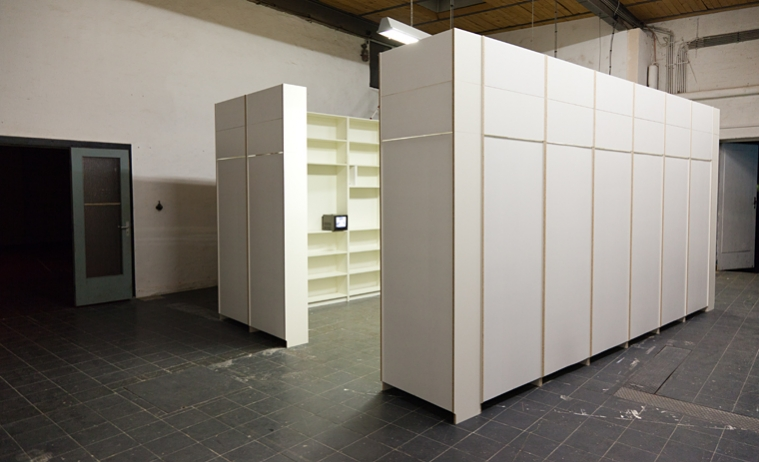
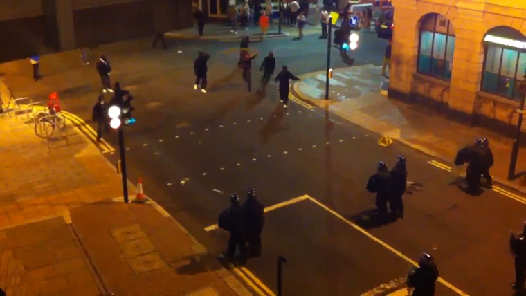
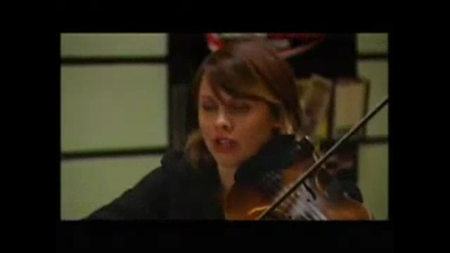
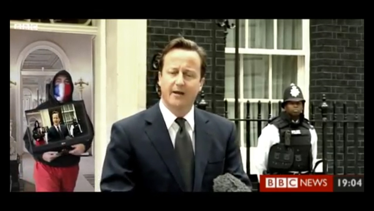

# #londonriots

Date: 2011/06/01
Authors: [Jonathan Pirnay](http://johnnycrab.com)
MaxWidth: 760px

---
---

__barnhouse21__ _8. August 2011 00:06_  
Twitter causing trouble again #londonriots

\#londonriots is a book of almost 700 pages containing around 20.000 tweets, each marked with the hashtag ‘#londonriots’.

Between the 6 and 10 August 2011 rioting, looting and arson took place in several districts of London, later also spreading to other parts of England, including Birmingham, Bristol, Manchester and Liverpool.

All 20.000 printed tweets have been posted on a single day, 8 August, between 00:00 AM and 11:59 PM, and were collected using a script harvesting the social web engine topsy.com.
Each tweet alone is in itself merely an artifact and seems to be meaningless. It is the fleeting opinion of a single person, yet it captures a tiny moment of history. Each twitter user expressing himself suddenly becomes a contemporary witness and is thus writing down a small piece of history.

All these small fragments are ordered chronologically and represented equally within the book.
They form a Ulysses-like snapshot of one day of rioting, transporting the incredible mass of virtual tweets and opinions to a conventional data carrier – a book – and making the data amount thus – in some sense – more perceivable.

In January 2013, #londonriots was exhibited in the group exhibition _Differenz und Wiederholung_ (INTERIM Kassel) and has been extended with a 564 minutes long video loop which consists of all YouTube videos mentioned within the book.

