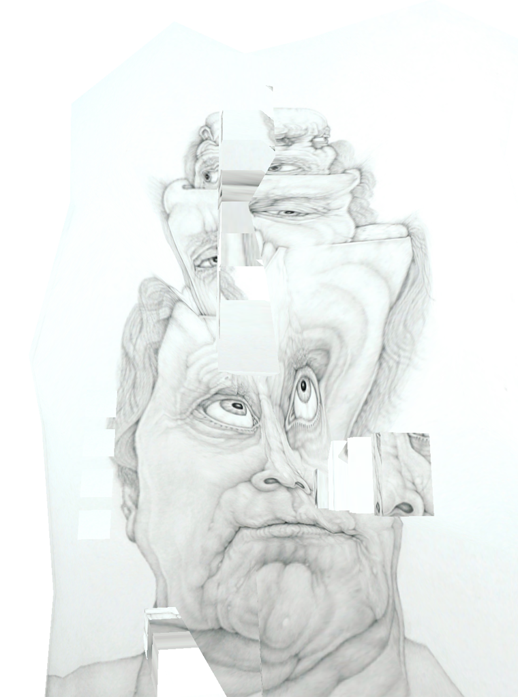
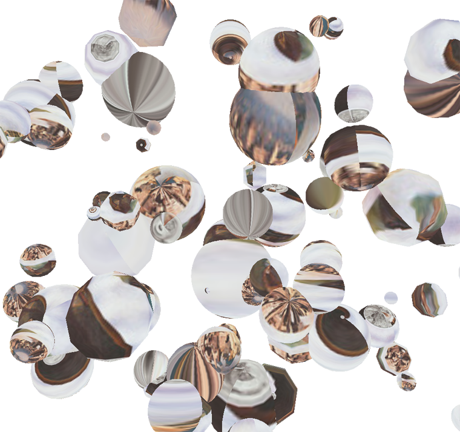
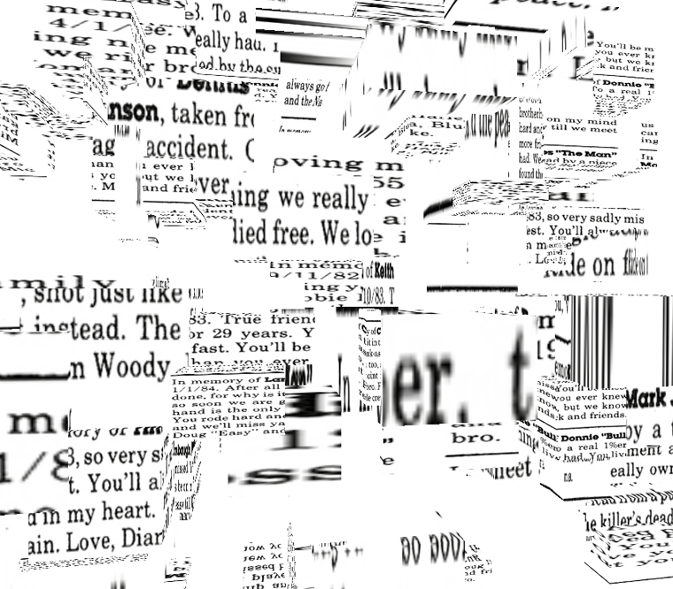

# can't see 3D

Date: 2011/10/01
Authors: [Kima Asendorf](http://kimasendorf.com), [Jonathan Pirnay](http://johnnycrab.com)

---
---

“_can’t see 3D_” is a tumblelog building virtual sculptures fomr images found on websites.

A script grabs one entry after another from a database consisting of more than 400 URLs, all of which have been submitted to cantsee3d.tumblr.com by the public, afterwards pulling around 50 images from each URL and its subpages. Then an OpenGL-sculptor transforms them into three-dimensional virtual objects which are then directly uploaded to the tumblr site for all to see and share.
By directly uploading it, each virtual sculpture exists only for a very short moment, and is thus addressing the fleeting nature of tumblr itself.
On a characteristical tumblelog you see something, but in an instant something else is posted or reblogged, adding up to that big pile of data that is already existing, always growing, never really perceivable, its content always repeating itself.

The aim of can’t see 3d is to reflect this phenomena by creating a continuous image stream and turning these images into virtual artifacts. It’s not a quality problem – it’s a quantity problem. Most images on tumblr deserve to be seen, but tons of weakly curated and poorly designed tumblelogs reblog and spread countless images until their value gets completely lost. By turning these devalued images into unique virtual sculptures, on the one hand can’t see 3d reclaims them as works of art, on the other hand, though, it’s just another part of tumblr’s “big mass destruction service”.

After all URLs have been processed, can’t see 3d is turned off – thus limiting its own pile of digital waste.

[cantsee3d.tumblr.com/](http://cantsee3d.tumblr.com)

