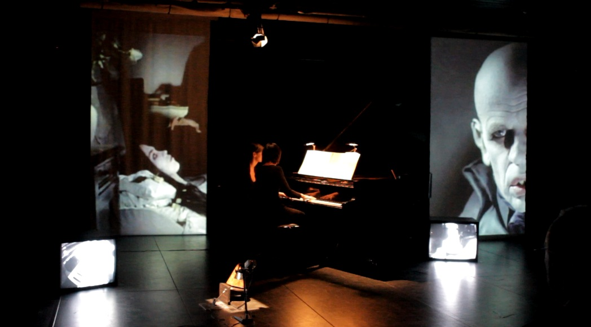

# Horror³

Authors: Joel Baumann, Tobias Zarges, Sebastian Haydt
Date: 2012/12/01

---
---

Horror³ Musik und Film- performance MM51

Die Pianistin Ji-Youn Song spielt an drei Abenden Mauricio Kagels _MM51_ zu jeweils einer Live-Filmcollage aus Nosferatu, Die Nacht der lebenden Toten und Alien.

<iframe src="https://player.vimeo.com/video/54924950?title=0&byline=0&portrait=0" width="500" height="281" frameborder="0" webkitallowfullscreen mozallowfullscreen allowfullscreen></iframe>

<iframe src="https://player.vimeo.com/video/53421418?title=0&byline=0&portrait=0" width="500" height="281" frameborder="0" webkitallowfullscreen mozallowfullscreen allowfullscreen></iframe>

<iframe src="https://player.vimeo.com/video/53673049?title=0&byline=0&portrait=0" width="500" height="281" frameborder="0" webkitallowfullscreen mozallowfullscreen allowfullscreen></iframe>
