# FritzToSpace

Date: 01-02-2013
Authors: [Jonathan Pirnay](http://johnnycrab.com), [Jörn Röder](http://joernroeder.de)
Keywords: net art, hacking, axe appollo, nodejs
Description: short description here!

---
---

In 2013, Unilever's male cosmetics subsidiary »AXE« launched a campaign called the »AXE Apollo Space Academy« in order to advertise its new »AXE Apollo« product range – a deodorant, shower gel, shampoo/conditioner and styling gel. In a large scale commercial campaign with the slogan ___»Leave a man, come back a hero«___, AXE tried to depict the character of the astronaut as the most masculine of all males, by women preferred to all other men.  
Within the campaign, you had been given the opportunity to register on the website [axeapollo.com](http://axeapollo.com) and encourage your friends to vote for you by clicking a »vote«-button, entering a valid email address and a reCAPTCHA (to prove you're human) . After approx. two months, the champions would be drawn at random from the participants with the most votes, winning a place at the »AASA Space Camp« in Orlando, Florida. Quoting AXE, there the winners would be _»put through rigorous astronaut training. Be warned – this is not for the faint-hearted. […] We'll assess your abilities and the top recruits will be chosen to go into space – as in, actual space«_.

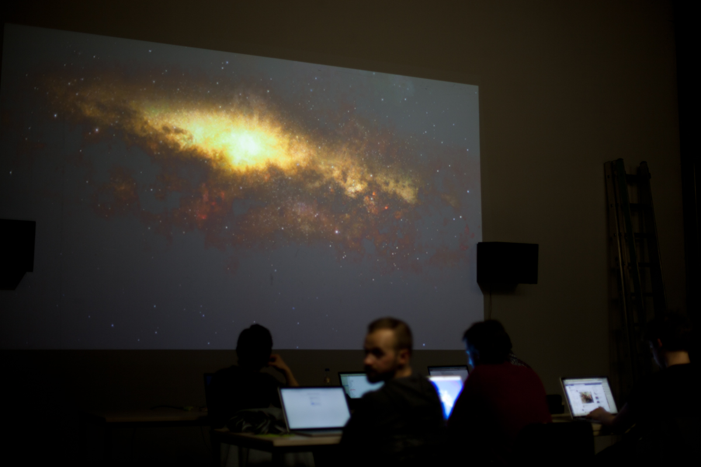

Under the motto ___»Leave a nerd, come back a hero«___, we coded a system with the intention to send our friend and fellow student [Fritz Laszlo Weber](http://fritz-weber.de) to first position – and maybe space.  
Technically speaking, a Google Chrome extension takes the place of the user, simulating clicking and typing, surfing anonymously through a Tor proxy. A node.js server provides each Chrome extension with email addresses from a list of thousands of valid addresses from facebook.com which have been collected in an earlier process.
Furthermore, the server accesses each user's Tor controller, thus taking care of requesting new identities, providing the voter with fresh IPs from all around the world.  
In short, all the voter has to do is type in the reCAPTCHA, hit enter, wait a second for a new identity and mail address, type in the captcha, hit enter, wait for address and identity, etc. etc.

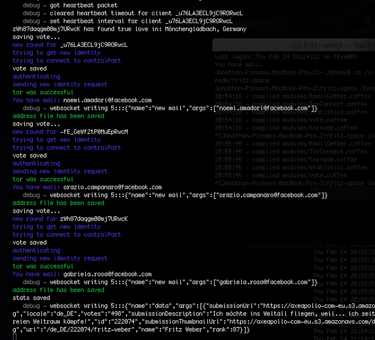

In the evening of 15 February 2013, some fellow students gathered to register Fritz on axeapollo.com and »vote« him from around position 15000 to position 1 on the German/Austrian/Swiss leaderboard with a small margin – but no further; all actions would be limited to this one event. 

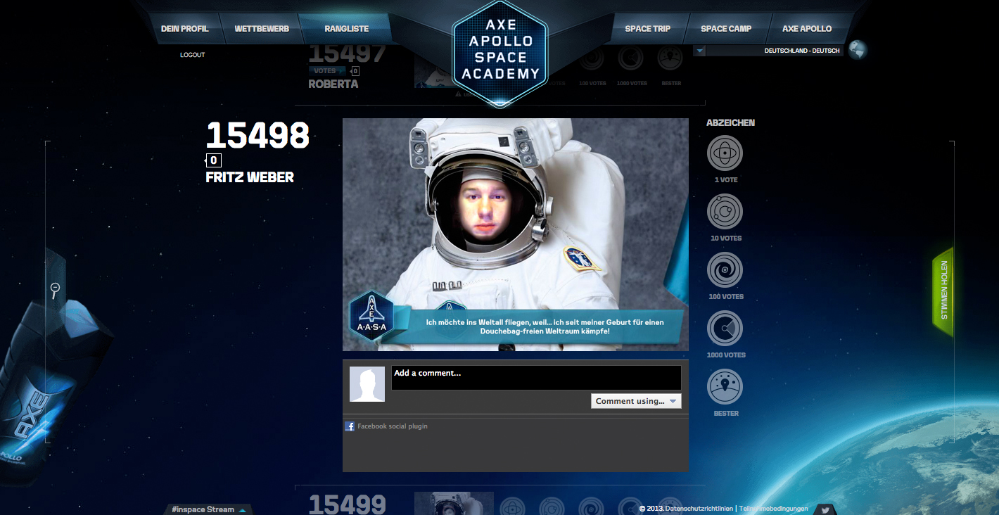<iframe src="//player.vimeo.com/video/61797215?title=0&amp;byline=0&amp;portrait=0&amp;color=ffffff" width="760" height="507" frameborder="0" webkitallowfullscreen mozallowfullscreen allowfullscreen></iframe>  

With that in mind, FritzToSpace should be seen as an experiment.  
It is an attempt to confront the absurdity of such commercial campaigns with even more insanity.  
It is an attempt to slowly approach the exploitation of computer system flaws as a form of creating something new. Not always necessarily art, but beyond the usual finding and fixing, or finding and destructively capitalising system flaws.  
FritzToSpace is an experiment to treat hacking as a form of communication and social expression, exploring its possibilities and how this consciousness – as well as the consciousness of possible security flaws – shapes creative decisions.

Fritz Weber reached first place around 1.30 a.m., 16 February 2013, with 4.000 votes.  
The day after, he was overtaken, but stayed on second place until the end of the competition.  
He participated in the drawing, but didn't win a ticket to the AASA Space Camp in Florida.  
Unfortunately, Fritz Weber didn't fly to space, instead he was awarded with a consolation prize: a packet full of AXE Apollo products.

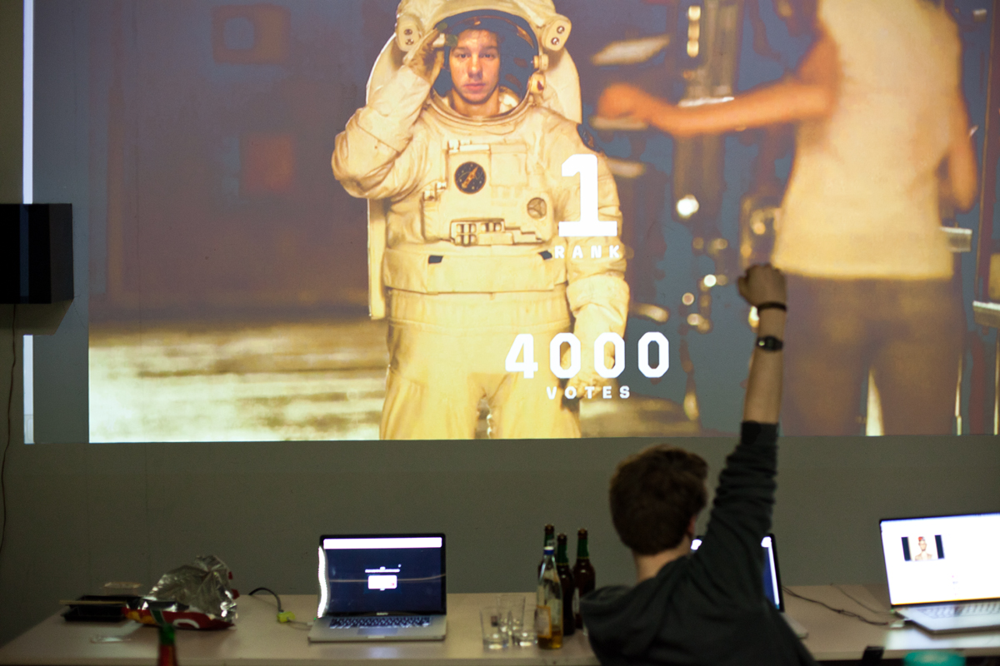

_FritzToSpace has been exhibited at the »Rundgang 2013« in Kassel, Germany._

---

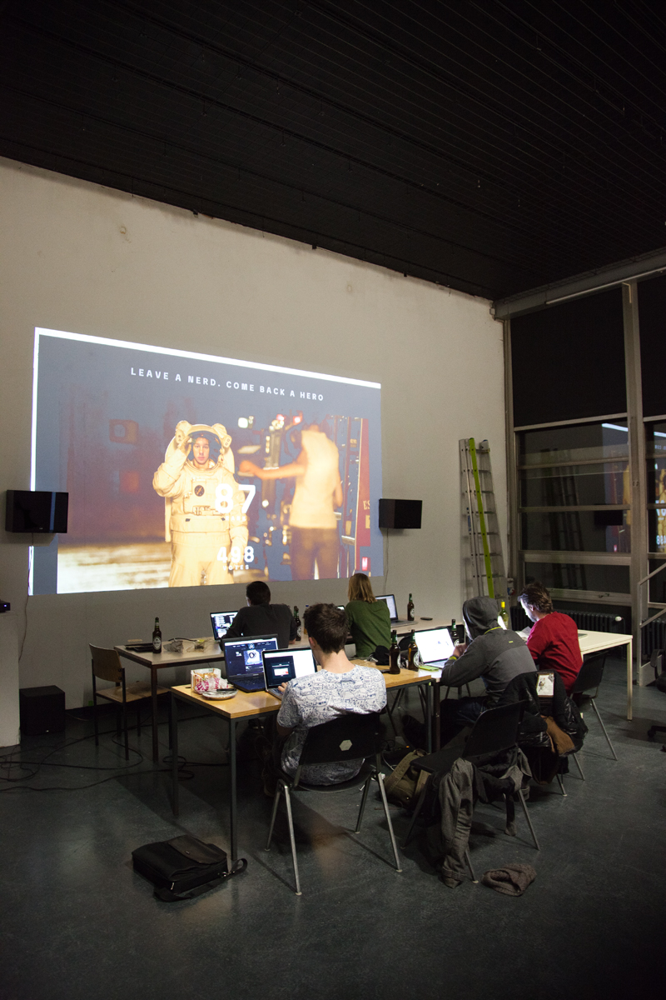

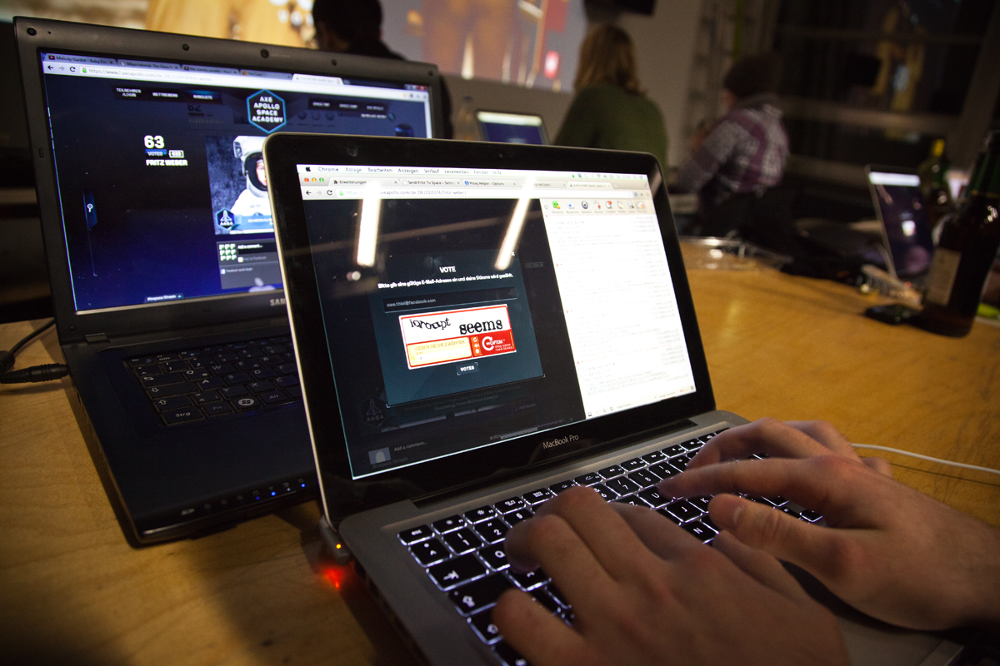
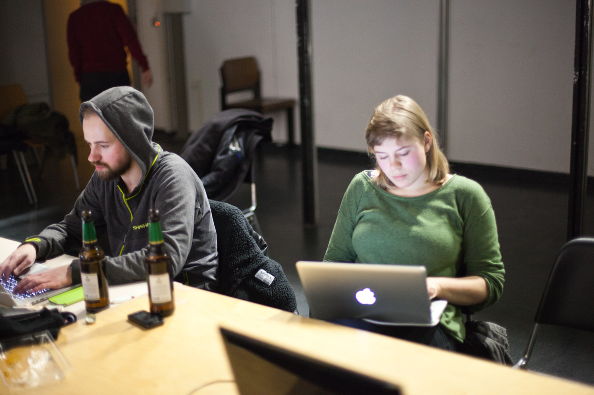

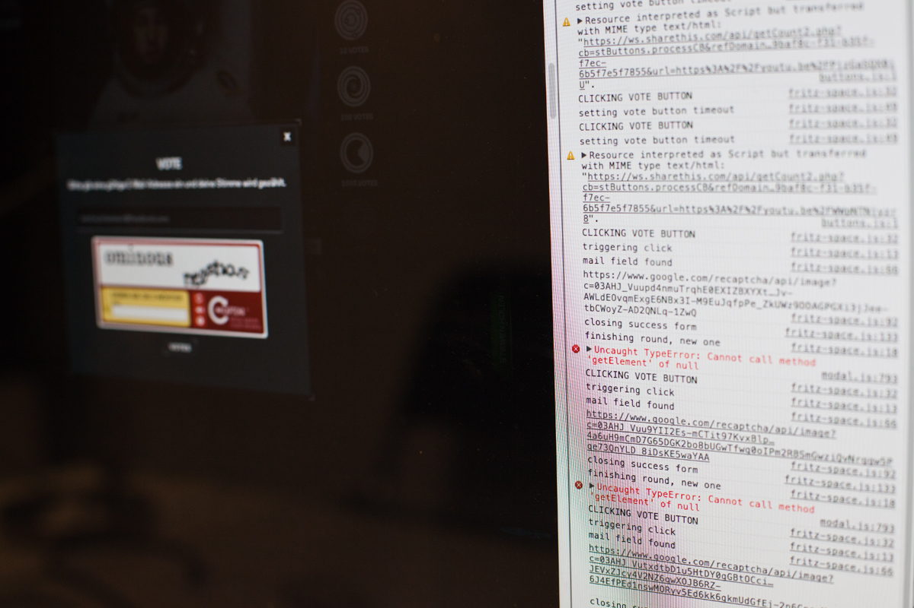
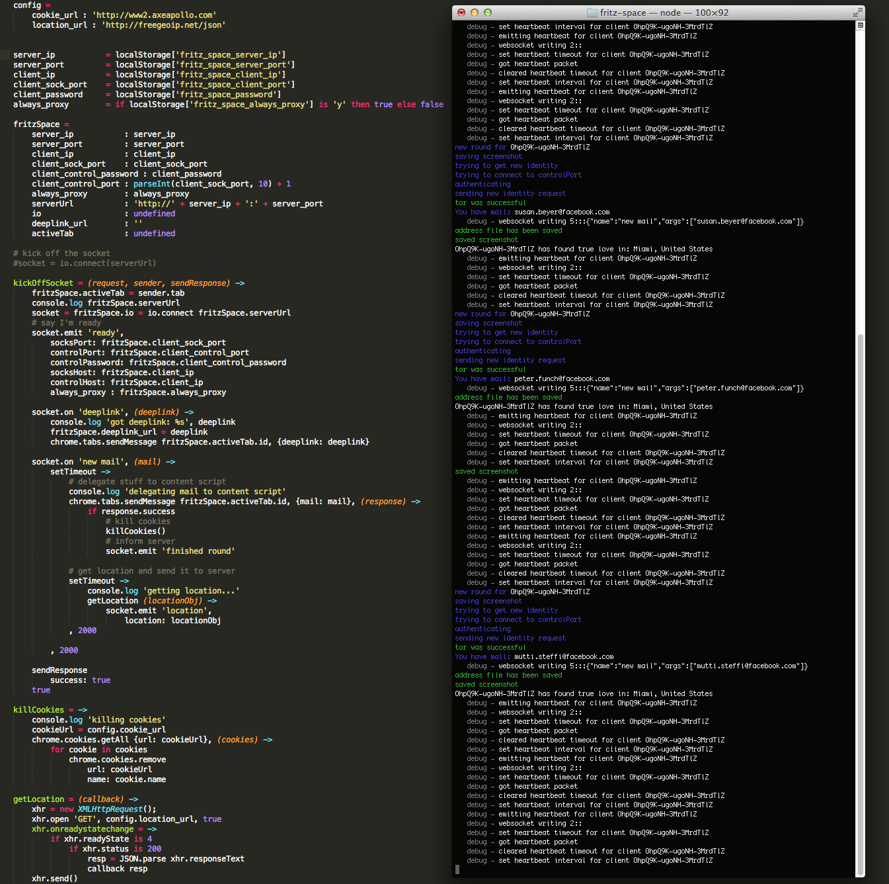

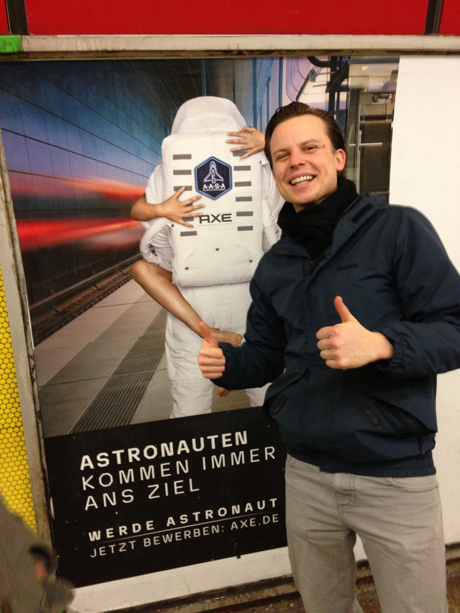
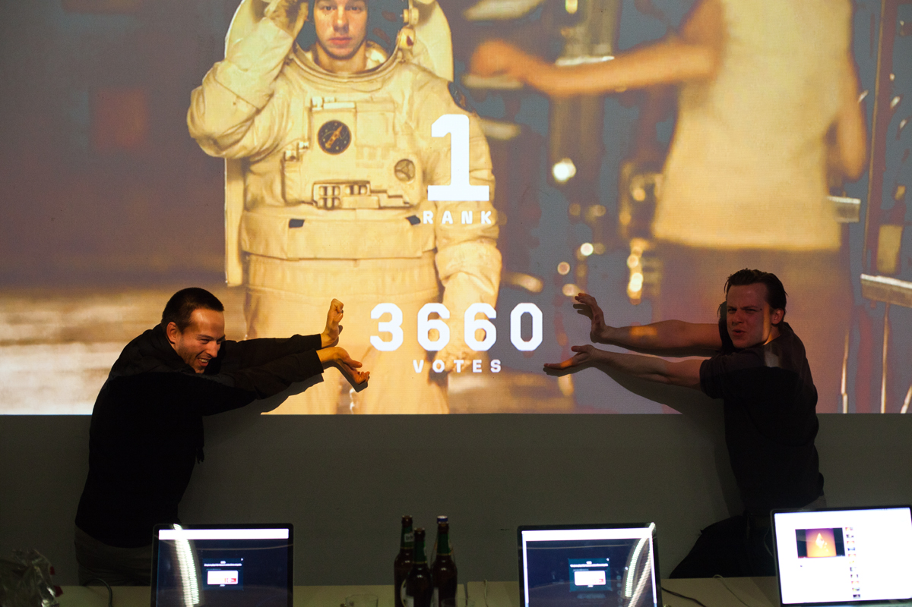
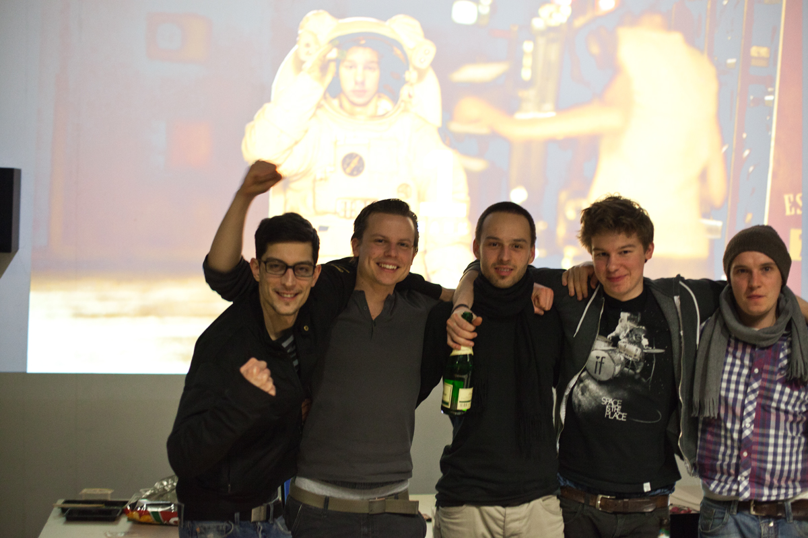
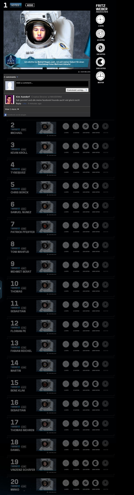

---

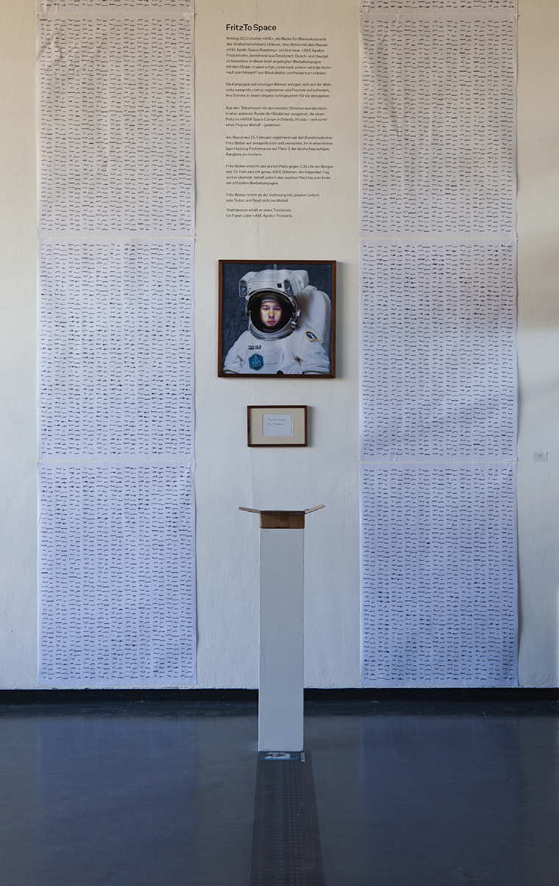
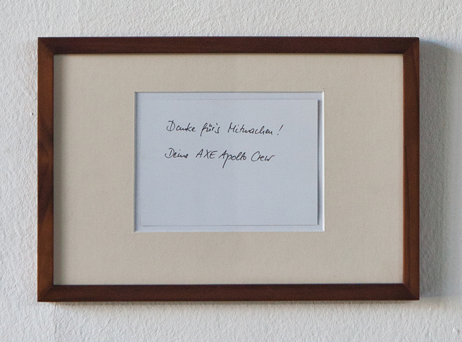
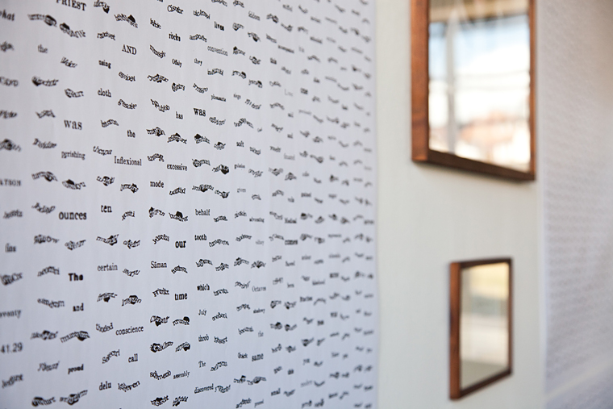

