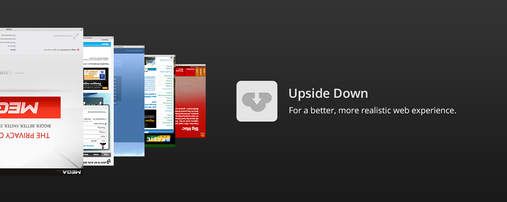

# Upside Down

Date: 2013/02/01

Authors: [Jonathan Pirnay](http://johnnycrab.com), [Jörn Röder](http://joernroeder.de)

---
---

»Upside Down« is a Google Chrome browser extension which provides a more realistic surfing experience. The Internet's aim – the »cloud«'s aim – is to provide information as fast as possible and to concentrate it in one point – your computer – while at the same time trying to hide the information's geographical whereabouts as effectively as possible. This abolishes all human sense of time and distance and distorts the user's healthy perception – leaving him or her devastated, lonely and out of touch with reality.

»Upside Down« extends your browser by giving you a small hint of what is really going on behind the scenes. 
»Upside Down« turns all website content which is stored in the opposite hemisphere – well, upside down, thus assuring at least some healthy sense of reality.

Surf upside down – for a better, more realistic web experience.

---

_»Upside Down« has been developed exclusively for the [DVD DEAD DROP Vol. 5, BEST OF](http://www.movingimage.us/exhibitions/2012/08/16/detail/dvd-dead-drop/) exhibiton at the Museum of the Moving Image, New York and is now available in the [Chrome Web Store](https://chrome.google.com/webstore/detail/upside-down/lnabgloolhfhgfkjmjlhoeflcogbmkpc)._