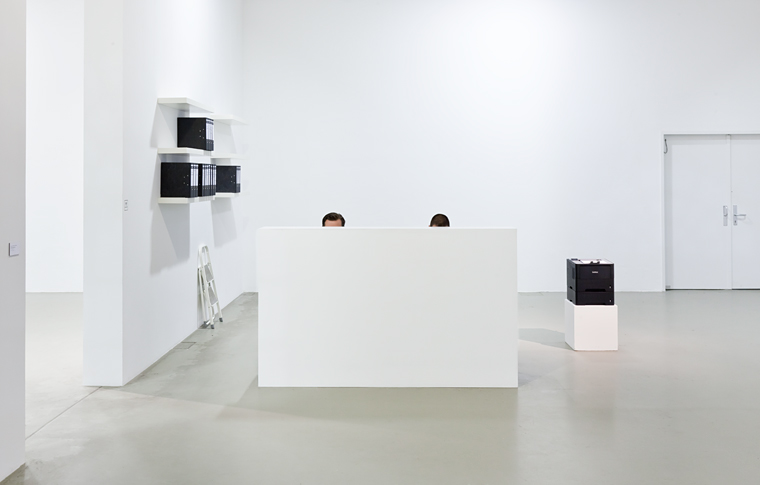
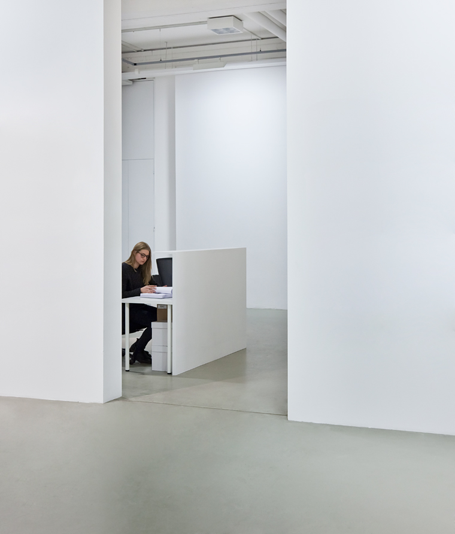
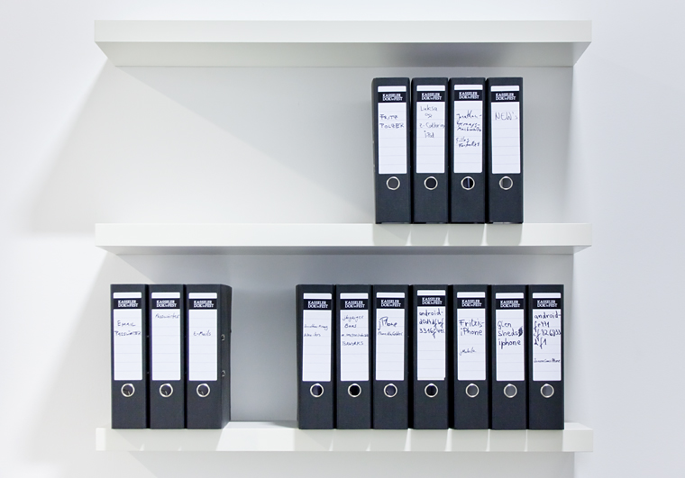
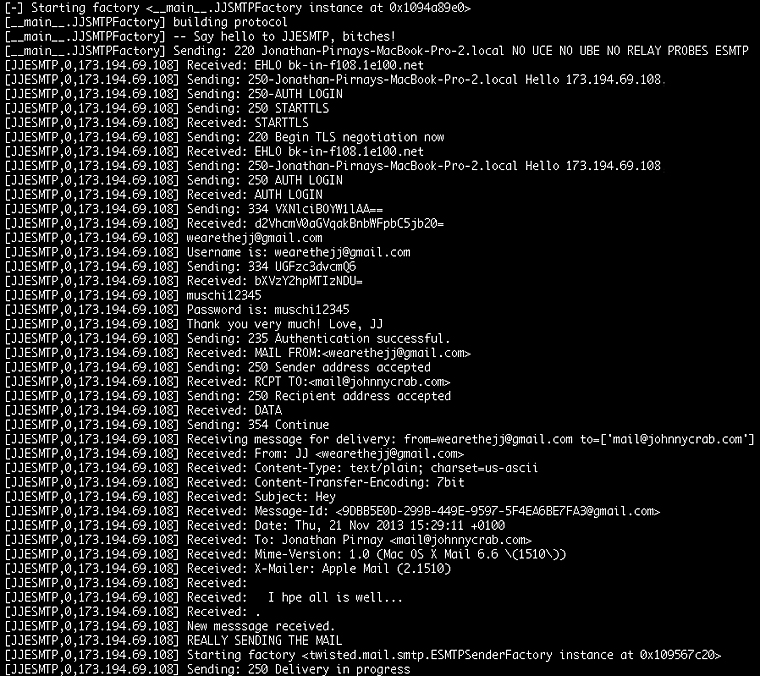
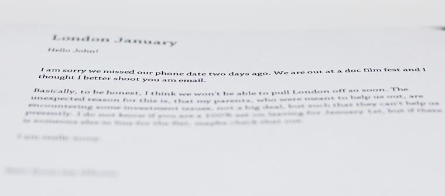
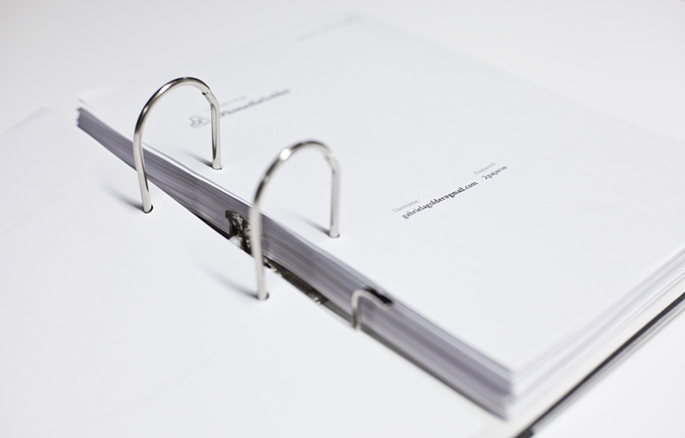
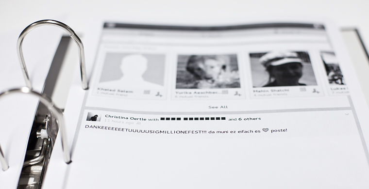
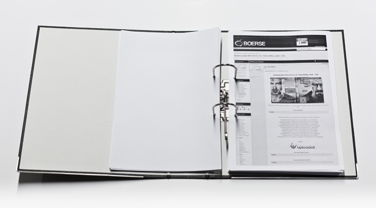
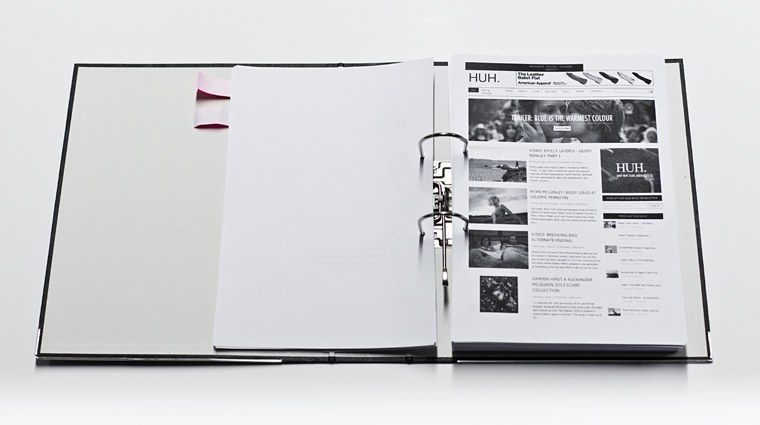

# 100% Security

Date: 2013/07/01

Authors: [Jonathan Pirnay](http://johnnycrab.com), [Jörn Röder](http://joernroeder.de)

Keywords: performative installation, security, NSA, Obama

MaxWidth: 760px

---
---

> You can't have 100 percent security and also then have 100 percent privacy and zero inconvenience.  
_– Barack Obama, 2013_

In June 2013, the American computer specialist and former NSA employee Edward Snowden revealed top secret documents belonging to the United States Secret Service. He made public information on how the USA, together with allies such as Great Britain, have been secretly monitoring wide parts of the global internet and telecommunications – automated and without proof of a probable cause.

The eight spy programs known so far – among them »PRISM«, »XKeystore« and »Tempora« – deliver information about the day-to-day behavior of Apple, Microsoft, Facebook, Google and Skype users by absorbing the data directly from the servers of these cooperating corporations. Other programs make it possible to read the data and locate the position of smartphones as well as targeting the infrastructure of the internet and other global information networks. Various tools are available to gather, pool and analyze global communication, invade outside networks or decode encrypted information. These tools are also used for reconnaissance of foreign satellite communication, spying on financial data, as well as the surveillance of international postal traffic and the Belgian telecommunication company Belgacom. Among the customers of Belgacom are the European Commission, the European Council, the European Parliament and NATO. The scandal intensified when it was made public that representatives of the European Union and even the center of the United Nations were wiretapped.

A world wide debate ensued and showed the public’s shaken trust in the status of the United States and Great Britain as democratic countries. The muted political reactions of many EU countries, especially the German government’s lack of a distinct political position, left many citizens feeling helpless in the face of overly powerful back-room politics.

These issues are explored in the installation _100% Security_: a small, nondescript office in which the complete traffic of an open public wireless network, installed for the duration of the exhibition, is printed out. Every page accessed by users, every password, every email is intercepted and sent through a printer. The provoking installation aims to create an awareness of the issues surrounding digital surveillance. Edward Snowden's revelations renewed interest in questions about the freedom of the internet, the intensifying abstraction between ”me and the internet” as well as the uncertainty of the individual towards his or her responsibilities and rights. Governments should care for the security of their citizens, however, is constant surveillance lawful? If I am liable for my internet connection’s data stream, does this mean that I have to monitor it? The installation also speaks within the context of art. The immediacy and simplicity of publicly printing out personal data enables a debate on a level beyond algorithms, cryptographic methods and data packages.

---

_100% Security has been exhbited at Rundgang 2013, Kunsthochschule Kassel and [30th Kassel Documentary and Video Festival](http://kasselerdokfest.de)._

