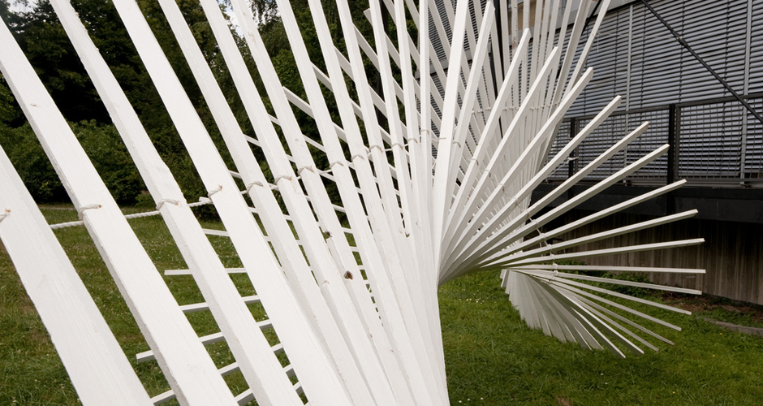
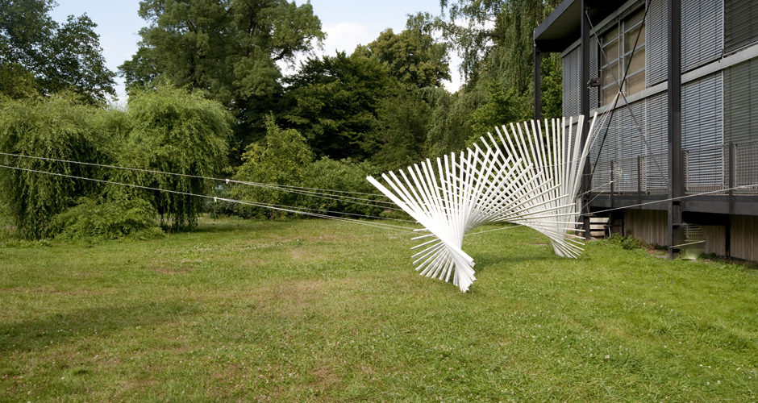
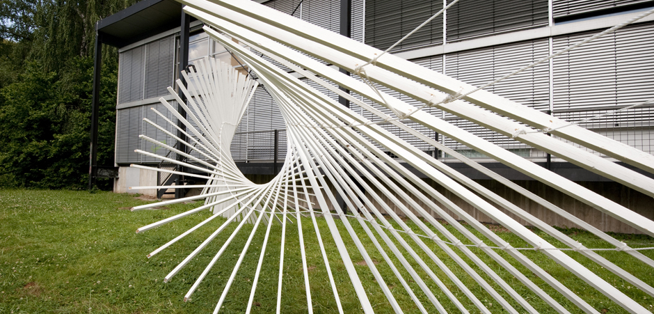

# White Noise

Date: 2013/07/01

Authors: [Martin Böttger](http://www.tsaworks.com/)

---
---

  

  

  

The installation **WhitheNoise** is based on a computer generated shape, the idea was capture from the performance [mikado sticks](http://vimeo.com/859018). White Noise was shown at Rundgang 2010 School of Art and Design Kassel. The installations maximum deviaition is 3x5 meters. 
