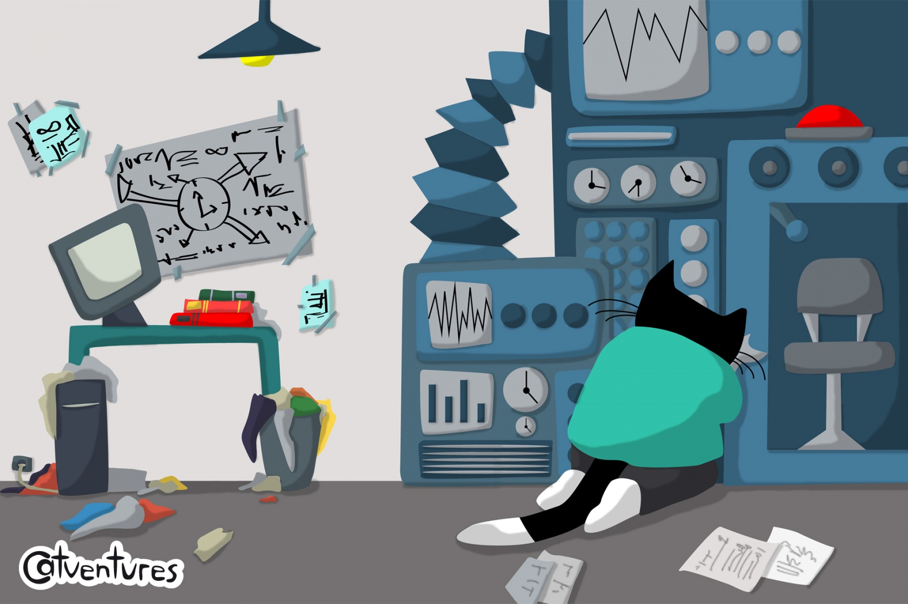
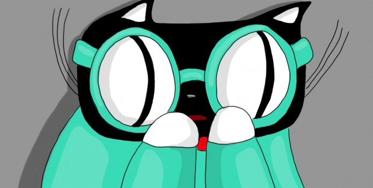

# Catventures

Date: 2013/11/01

Authors: [Sebastian Haydt](http://derhintergrund.com)

---
---

  

_CATVENTURES_ is a jump and run game about a scientist- cat traveling in time to save his nieces and nephews and to bring them safely back to the present. One day the scientist is building on his time machine when his two nephews and two nieces come in his laboratory for a visit. Curiously they run to the machine and start playing with it, when suddenly the machine goes on and the kitties disappear in different centuries. Now it´s up to the scientist to travel in time and bring the kitties back to the present.

__Programming:__ Sebastian Haydt  
__Graphics & Animation:__ Maike Koller  
__Music:__ David Lugo

<iframe src="https://player.vimeo.com/video/78214646?title=0&byline=0&portrait=0" width="500" height="281" frameborder="0" webkitallowfullscreen mozallowfullscreen allowfullscreen></iframe>

  

