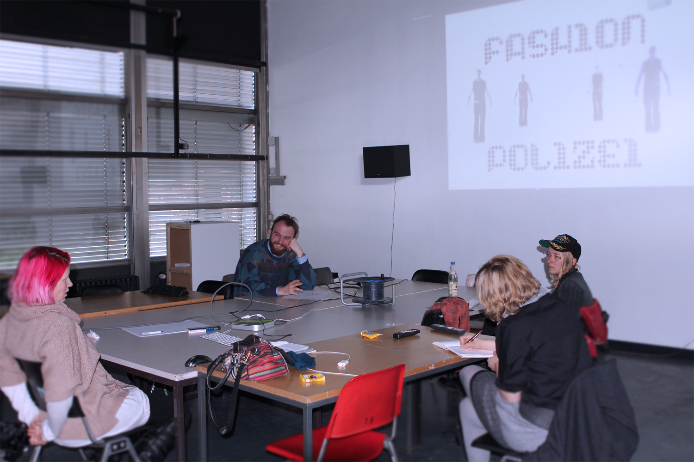

# Illegal Art

Date: 2014/01/01

Authors: [Hans Bernhard](http://ubermorgen.com), [lizvlx](http://ubermorgen.com)

Type: Workshop

---
---

  

We identify legal norms in conflict with the right of free speech and/or the freedom of art and develop own projects that seem to be contrary to law or at least seem as such.

During the workshop we take a look at the boundaries between 
'Legal Art', Written Warnings & AGB and conceptual art, both theoretically and practically.