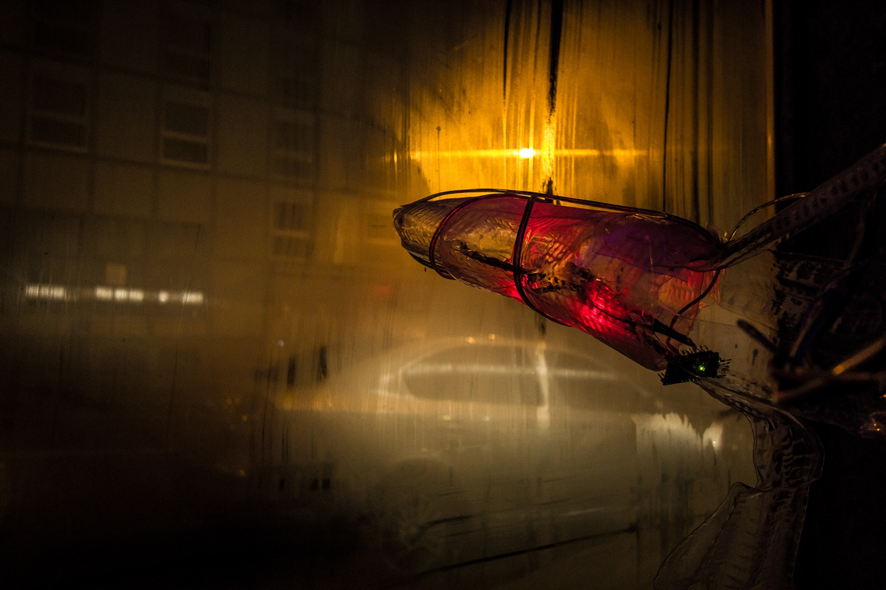

# LOVE.ME.ZERO

Date: 2014/02/01

Authors: Isabel Paehr, Jasper Meiners

---
---

<iframe width="750" height="420" src="//www.youtube.com/embed/QgVlssAnSaw" frameborder="0" allowfullscreen></iframe>

  

An experiment: the extinction of a kind. An evolutionary game considering the survival of an algorithm. The frozen flight of a firefly cutting the frontage of urban darkness. The installation LOVE.ME.ZERO tries to call the passenger's attention with different computer generated light and sound rhythms, observing them via motion sensor. If the artificial intelligence fails, the seperate bodies will die one by one until the machine turns off.

    

Take a look at nature: nature dies. What about the cities? Urban Space gets less important considering its habitants spend most of their time in the digital world. Shop windows are emptying, big parts of cities become irrelevant. What if we give them the strategies they need to recapture their relevance in human life? Will they succeed or has the real world become replaceable?

  

Making Of: 

LOVE.ME.ZERO was developed during the research seminar "URBAN GLOW" by eek Kassel and Kunsthochschule Kassel (Olaf Val, Vanja Juric, Timo Carl) and a cooperation between architecture, product design and new media students. The challenge was to design concepts to reintegrate empty shop windows into the city using and deepening technical knowledge as programming (basically Processing & Arduino), biological strategies by analyzing different species, studying the art of urban and digital intervention and progressing 3d skills to deep draw the final designs. 

The shop window we chose, Werner-Hilpert-Straße 23, Kassel, never had the best surroundings. 
Kassels Club Scene down the street, but a few strip clubs as well, the area is not known as very family friendly or friendly at all. Close to Kassel Main Station most people just travel by, using the opposite side of the street. The dark room behind the window made us realize very soon that we had to work with light. One organism convinced with its outstanding survival plans.

  

  

Fireflies use their light rhythms to communicate with partners over great distances. Their punctual light also protects them from natural enemies. That summer, analyzing many more animals, we saved a firefly from a spider. Captured in a cobweb, it continued to send light patterns into the night. 

Even though fireflies work with a small, punctual light, we began to analyze their behavior over time. Beginning their flight from the ground or a blade of grass, they are fast, but then they begin to draw interlaced curves into the air. 
Speed and slowness had to become part of the shape we wanted to create. 
We used thick wire to get a feeling for the flown ways and developed shapes out of the bug bodies and their movement. 3 LEDs were placed inside the body, turned on and off one after another it looked as if one animal would fly trough the night. We decided to create a frozen firefly flight.

  
  
  

  

The idea for the interactive concept sounded plausible, but was much more complicated in a technical way than expected. What if the population of 8 built fireflies would not need, once installed, our help to survive in a hostile environment?
It had to have an own intelligence. Using a motion sensor outside the window, it should be able to analyze by itself which light rhythms it created were successful (people would come from the opposite side of the street to watch it) and advance them. The solution was to develop a program, that could not only manage and develop light patterns but also administrate them by using lists.
In the end, one line in a long list would look like this, documenting the time of the "learning event", all eight bodies ("A" to "H") with 16 possible boxes to use its 3 lights (a pattern made of 0 and 1s, 0 for no lights, 1 for lights):

99:2014-02-18-07-16-41:A0000000100100000-B0000000010001000-C0111000000010000-D1001000000000001-E1110000000001100-F1000000110000111-G0111110110000101-H0100100000100011-0480:00

The last number is the product of an algorithm, generating a number that stands for the success of the used pattern. Knowing that nature is not a total understandable machine, we also inserted an evolutionary random value, so sometimes a body would change its behavior inside of the population.

  

But one thing everyone of us knows about nature: Every living creature must die. We had given everything to our firefly population we knew about simple artificial intelligence at that point of time. If that was not enough, if people were not interested in the light clusters, if urban space had no importance anymore, it must die. It would turn off its bodies one after another. 
Of course visitors could reanimate them by watching them over long periods of times. Death had never been a big topic in digital art. But what if an algorithm had to die if it was not successful?

We started our experiment.

