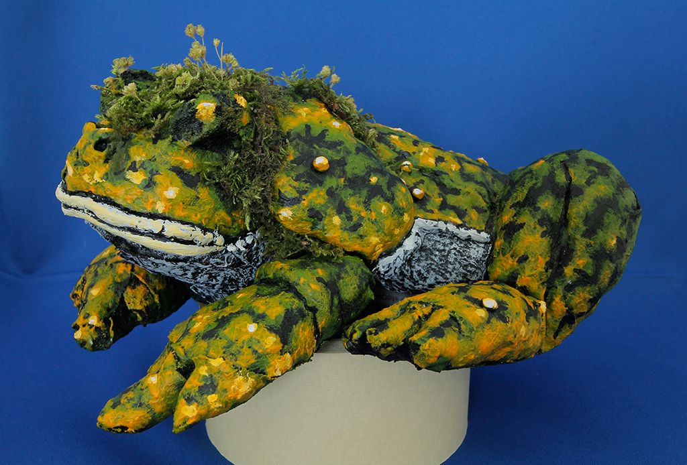
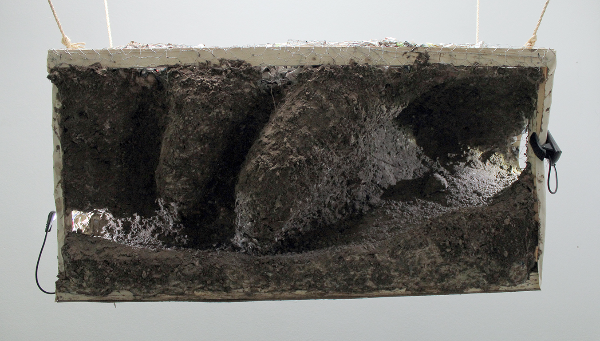

# SYMPTOM

Date: 2014/03/01

Authors: Isabel Paehr, [Jasper Meiners](http://jaspermeiners.com)

---
---

  

SYMPTOM is a puppet-trick-game, where the player wakes up as a mole on the back of a huge, hideous toad lady. 

Equipped with a flashlight you discover an inhospitable system of caves, that build up part by part: the only way of orientation is a small cone of light that flickers in the darkness. In this world of black space and noises, the player will intermingle with the character, finding both his inner self and a last, big decision. 

The world will be built 'in real life', lighted, photographed and digitally polished.

  

