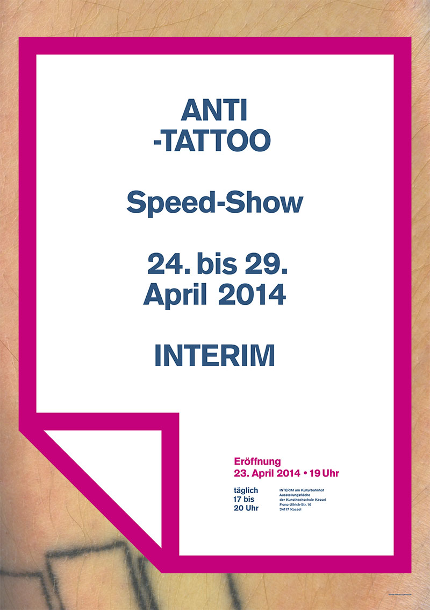
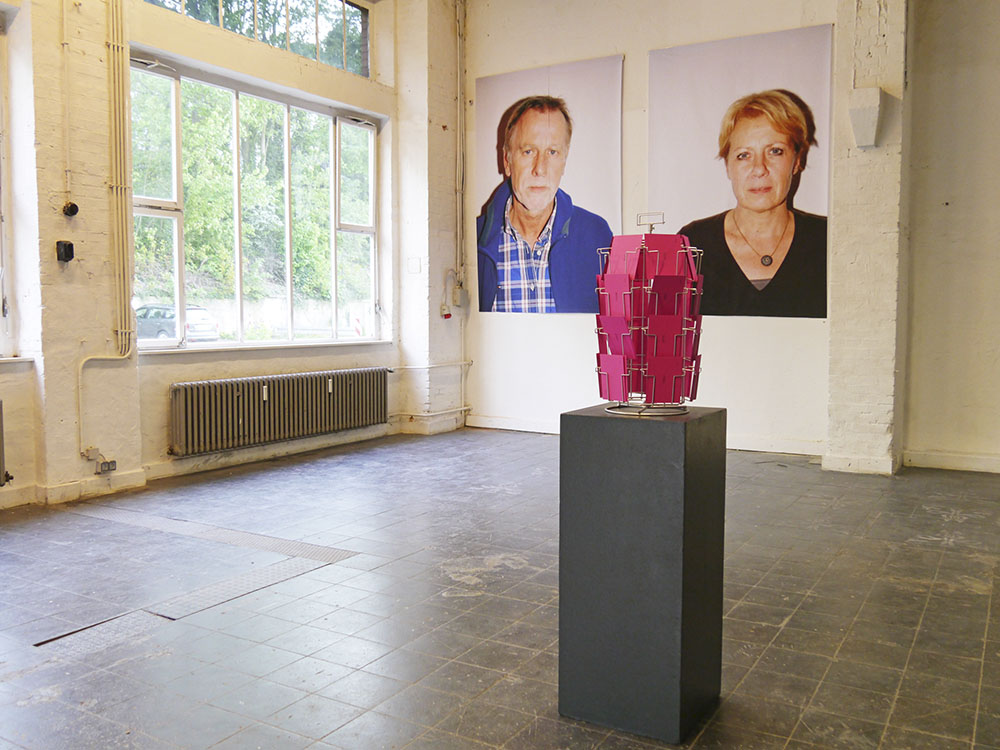
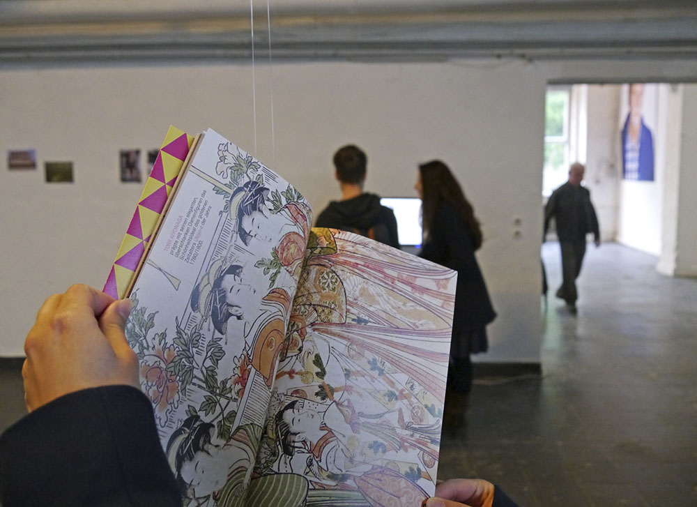
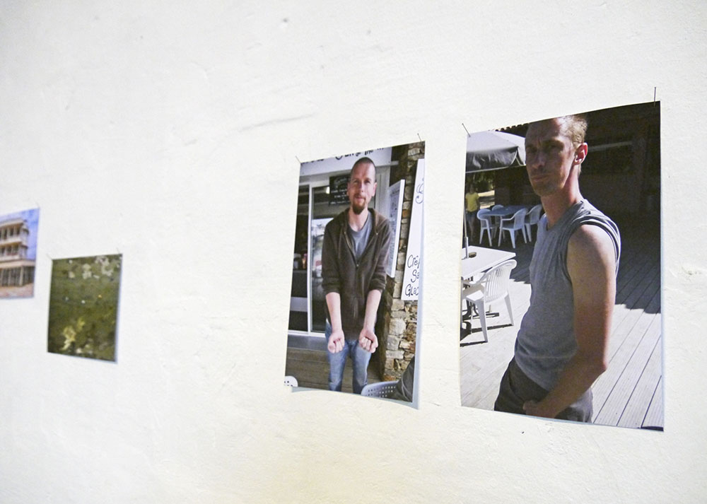
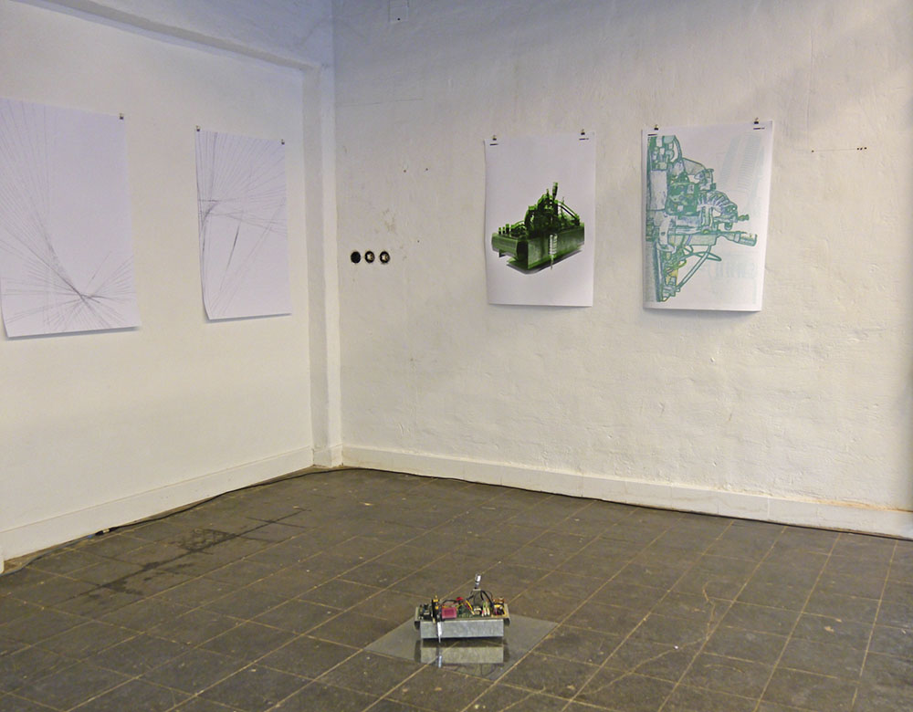
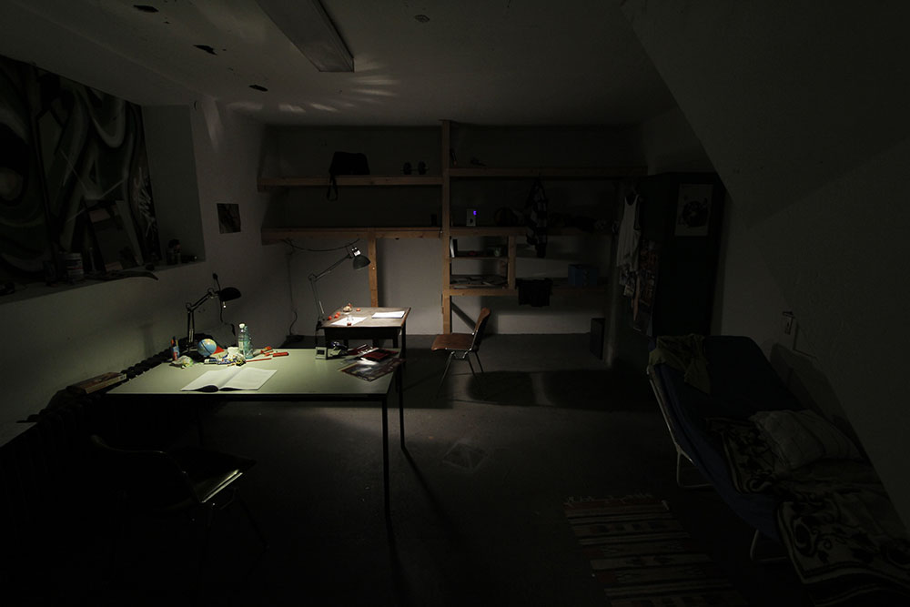
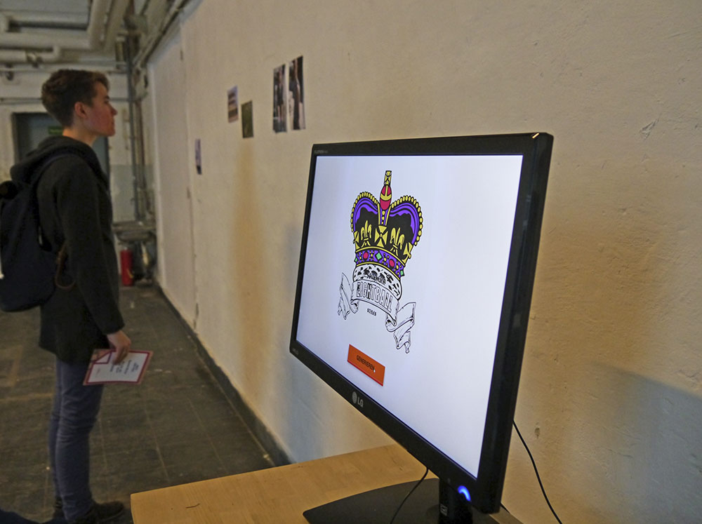
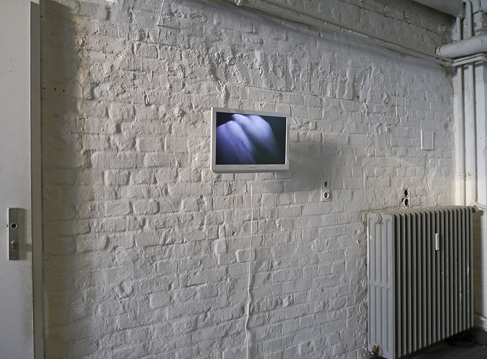
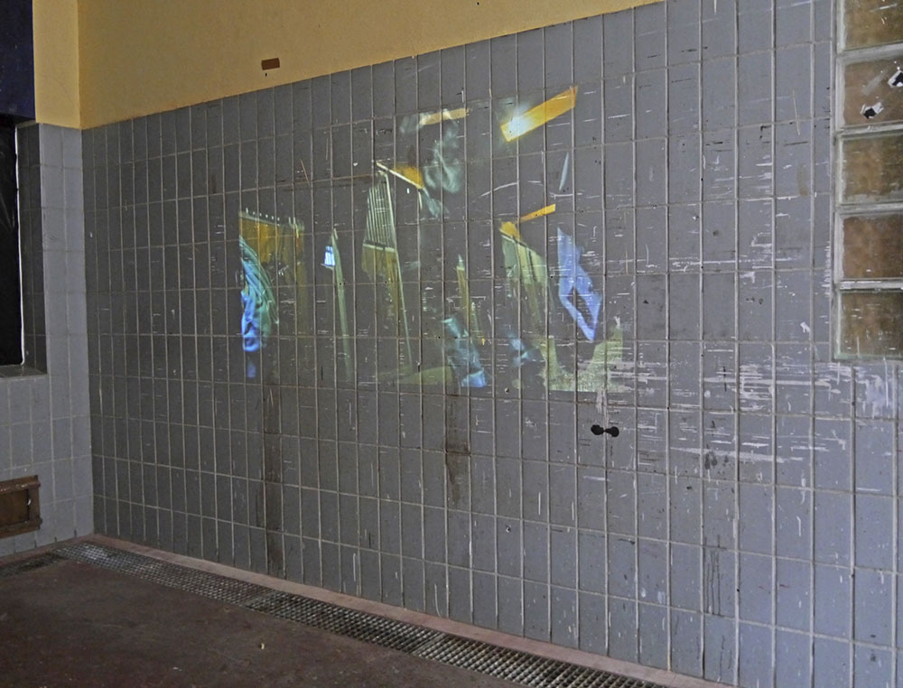

# Anti-Tattoo

Date: 2014/04/01

Type: Exhibition

Authors: Milena Albiez, Joel Baumann, Martin Böttger, Max Hänisch, Tobias Hellwig, Josephin Kollmer, Anne Kruggel, Lui Matthes, Isabel Paehr, Georg Reinhardt, Erik Schäfer, Ippolit Vikhorev, Isabelle Zaki

---
---

The project and exhibition _Anti-Tattoo_ was inspired by the suddenly voguish commerce of images on the body. As the debate proceeded, the themes varied. An individual reaction to the topic 'Tattoo' can be expirienced in twelve positions by students, alumni and contributers of the Kunsthochschule Kassel. 
Below, you can find a full description in German.

Das Projekt _"Anti-Tattoo"_ wurde durch Fragen über den scheinbar plötzlich salonfähigen, modischen Umgang mit Bildern auf dem Körper angeregt. Die Auseinandersetzung geriet in interessante Bahnen, die Themen sind vielfältig. Eine individuelle Rückkopplung an das Thema "Tätowierung" zeigt sich in den insgesamt 12 Positionen von Studenten, Absolventen und Mitarbeitern der Kunsthochschule.

Der Titel soll nicht verwirren! Es ist keine generelle Ablehnung des Einschreibens in die Haut gemeint: Das wäre selbst den Simpelsten unter uns zu flach! ANTI- entleihen wir Wortkonstrukten wie Anti-Materie, Anti-Depressiva oder dem Schillern einer unsteten Trennfläche zwischen positiver und negativer Konnotation, beispielsweise dem Antiautoritären und dem Antisemiten.

Mit Tattoos verbinden wir weit mehr als nur Zeichnungen in der Haut. Sie verbildlichen Riten der Einschreibung in bestimmte Gesellschaften: Polizei, Militäreinheiten, Knast, Rockabillies, Fussballvereine usw.usf. Sie sind Darstellungen der Grauzonen zwischen totalem Zwang in den verschiedensten Formen (im Sinne der Zugehörigkeit oder im extremsten Fall als Stigma einer aufgezwungenen Verwaltung) sowie der absoluten Freiheit am eigenen Körper und seiner Darstellung in der Gesellschaft. Heutzutage sind sie oft Zeichen einer physischen Akzeptanz unserer Konsumgesellschaft, die inzwischen weit in unsere Körper hineingreift. Durch sie gestalten wir uns oder wir werden verunstaltet.

In vergangenen Gesellschaften galten Tattoos als Erweiterung des Individuums, sie ermächtigten den Beschriebenen durch zusätzliche Kräfte und Eigenschaften. Ähnlich geht es im Internet zu. Unsere Avatare – virtuelle Erweiterungen unserer Selbsts – verleihen uns die Kraft der Telepathie und Zugriff auf vermeintlich unbegrenztes Wissen. Die Spuren, die diese virtuellen Körpererweiterungen hinterlassen, sind genauso permanent wie die Tinte in unserer Haut und lassen sich nur teilweise verwischen. Im seltensten Fall werden Sie wieder unsichtbar...

Die Haut ist unser größtes Organ, sie bildet die Trennwand zwischen uns und dem Nicht-Wir. Sie ist die erste physische Schmerzgrenze des Ichs zur Welt. Der Akt, sich ein Tattoo stechen zu lassen, ist eine Überwindung dieser Schmerzen um Zeichen zu setzen, die nicht nach Innen ins Ich, sondern nach Außen in die Welt reflektieren. Im Idealfall haben wir die Zeichen bestimmt und uns tief in unserem Inneren für die Symbole entschieden, die wir in einen dermatologischen Zwischenraum subkutan einschreiben lassen wollen, um uns zu präsentieren.

Wann und wo verschwimmen die Grenzen unseres Körpers? Alles menschlich Bewirkte entspringt dem Körper und wie ein Boomerang kommt es in der einen oder anderen Form auf den Körper zurück. Inwiefern bestimmen unsere Erfindungen unser Leben? Durch Technologie erfinden wir die Beschleunigung unserer Körper, um davon abhängig zu werden. Was bedeuten die Bilder, die wir unserem zukünftigen Ich aufzwingen?

