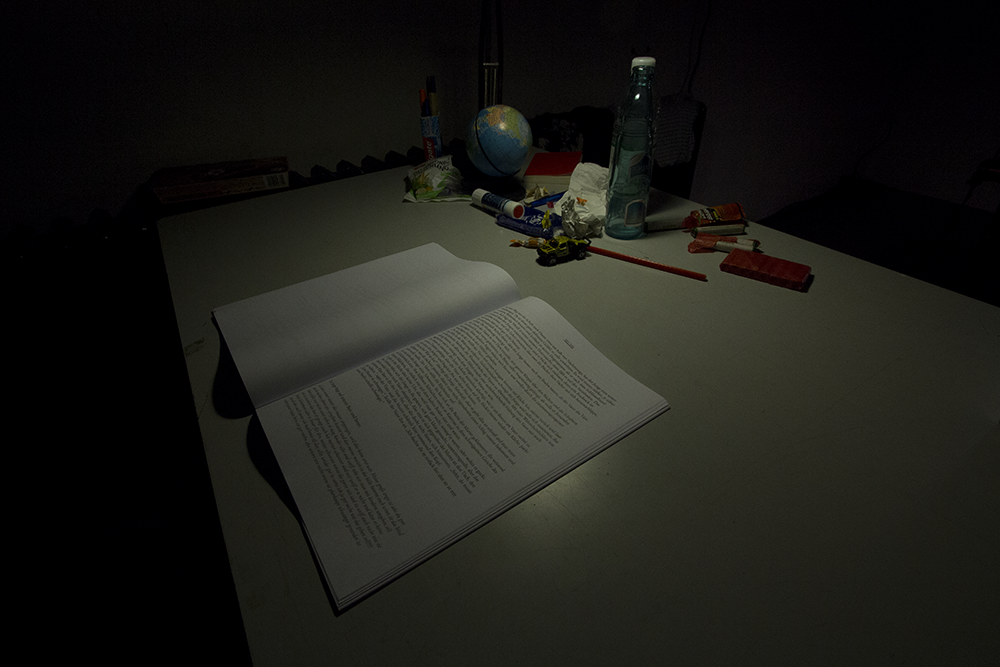
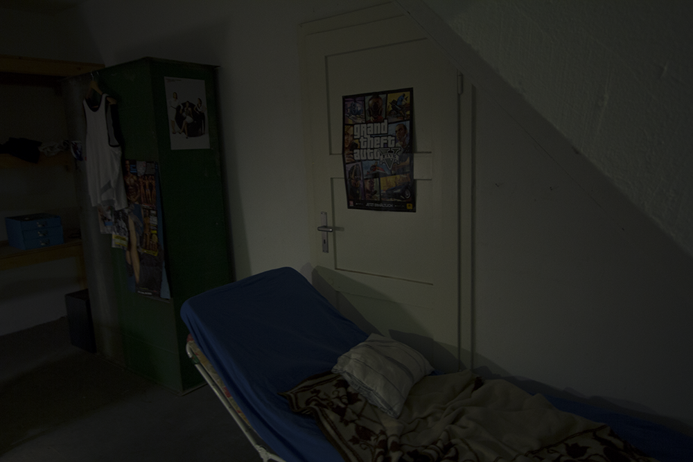
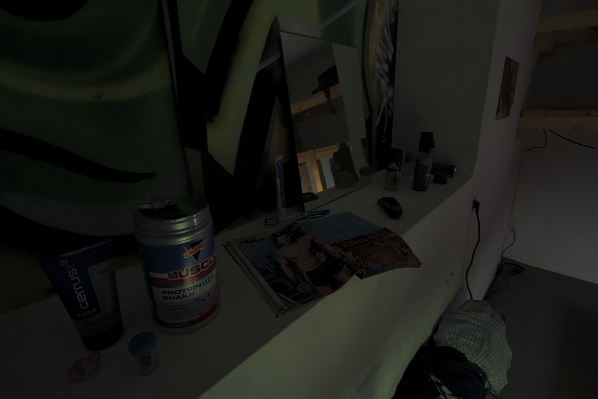

# FETZEN

Date: 2014/04/01

Authors: Isabel Paehr

---
---

FETZEN is a manuscript about a boy asking questions online. Some are funny, others very personal: 14 years old, he grows up, notices his body constantly changing into an adult, dealing with problems in school and being more and more abused by his brutal father.

More than 500 questions later, most being answered by the community gutefrage.net, the boy is now 16 years old and a strict believer.
FETZEN is the story between his questions, a fiction trying to bring together the fragments his real questions display.

  

Since the manuscript is still a work in progress, FETZEN was also exhibited as a room installation: Using objects the boy named in his questions, his room was reconstructed as precisely as possible, showing the current state of the manuscript in the middle. Visitors could either read or listen to a sound file to get in touch with the story.

  

Due to the sensitivity of the topic and because so far no one knows, who the boy behind the nickname actually is, the nickname and parts of the manuscript won't be revealed online yet.

  

