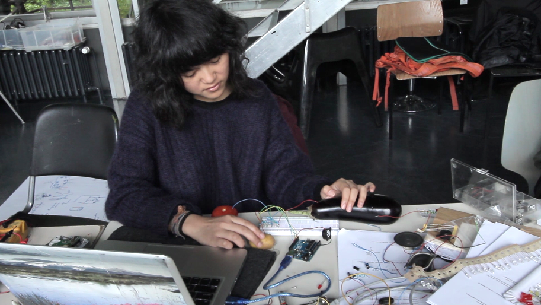

# Open Hardware

Date: 2014/05/01

Authors: [Stefanie Wuschitz](http://www.grenzartikel.com)

Type: Workshop

---
---

OPEN HARDWARE was about thinking technology and playing with it.
Different tools as Arduino, Processing and Raspberry Pi were learned and used, as well as political implications discussed.

The workshop was held by Stefanie Wuschitz.

