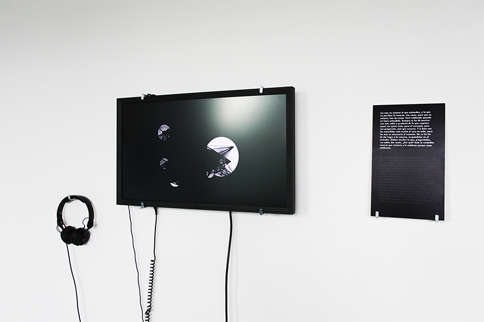

# Antagonism

Date: 2014/07/01

Authors: [Stefan Endres](http://stefanendres.com)

---
---

  

A signboard shows the aphorism “Do not explain overmuch“ by the spanish philosopher Baltasar Garcián in original language and translation.
In parallel, a system consisting of two antagonistic classes of particles, based on physical laws of attraction, infinitely generates image and sound. Neither image nor audio files are accessed – any acoustic and visual impulse is purely calculated in real-time. 

<iframe src="https://player.vimeo.com/video/109109053?title=0&byline=0&portrait=0" width="500" height="281" frameborder="0" webkitallowfullscreen mozallowfullscreen allowfullscreen></iframe>

This combination of generative art with a slice of philosophy questions the influence of interdigitations between aesthetics and (not) given context and indicates information, cognitive perception and their relation to each other as fundamental parts of communication. 
