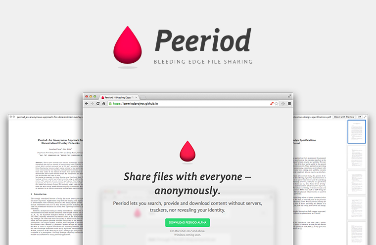

# Peeriod – Bleeding Edge Filesharing

Date: 01/09/2014
Authors: [Jonathan Pirnay](http://johnnycrab.com), [Jörn Röder](http://joernroeder.de)
KindOf: Peer-to-Peer Filesharing Network
Keywords: p2p, filesharing, anonymous, encryption, network, onion routing, decentralized, overlay network

---
---

»[Peeriod](http://peeriodproject.org)« is an open source project which strives for making privacy protected peer-to-peer file sharing available to the masses.  
Peeriod allows you to anonymously provide, search and download files without intermediary servers or trackers. Provided files are made available to everyone – without restrictions, but in a way that tries hard not to leak any information about what you search for, download or upload. When simply firing up the application, Peeriod builds independent encrypted paths with other users. All search queries and files are then sent through these paths, covering their origin and destination. This protects the identity of both uploader and downloader from the curiosity of eavesdroppers or other network participants.

Wile Peeriod runs in the background, its interface lives in a browser extension, providing a user experience in a familiar setting. A simple search input invites you to find the files you desire!

Peeriod is currently available for Mac OSX 10.7 and above. The Windows version will follow shortly.

For more information see [peeriodproject.org](http://peeriodproject.org)

Nerdly speaking, Peeriod's aim is to construct Onion Routing on top of a DHT, while at the same time avoiding certificate authorities. Each node is equally (un)trustworthy and can act as a relay node for encrypted traffic. A flooding-based search takes advantage of the DHT's structure and provides full-text search capabilities.

Interested? Take a look at [peeriodproject.org/#developers](http://peeriodproject.org/#developers), you'll find a link to the code, the concept, the design of the current implementation and its ups and downs.