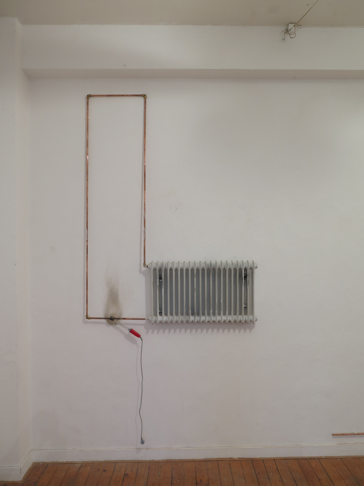
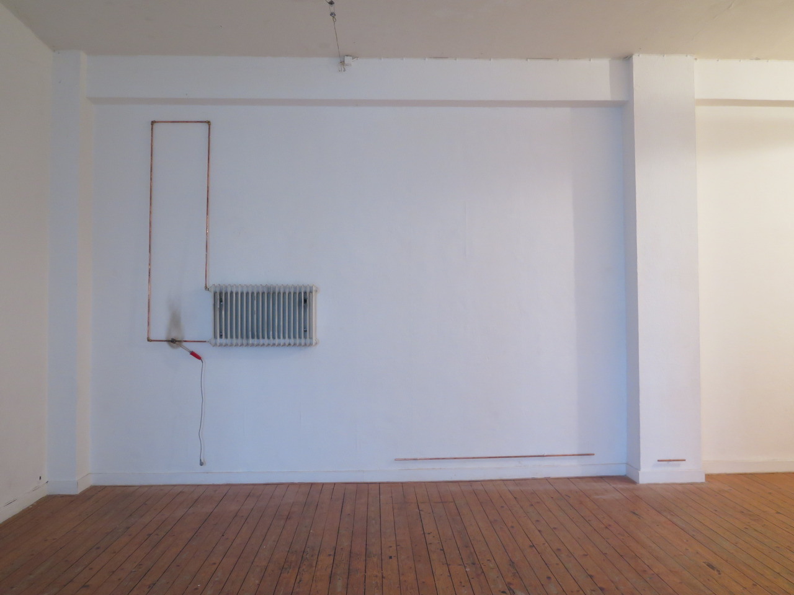
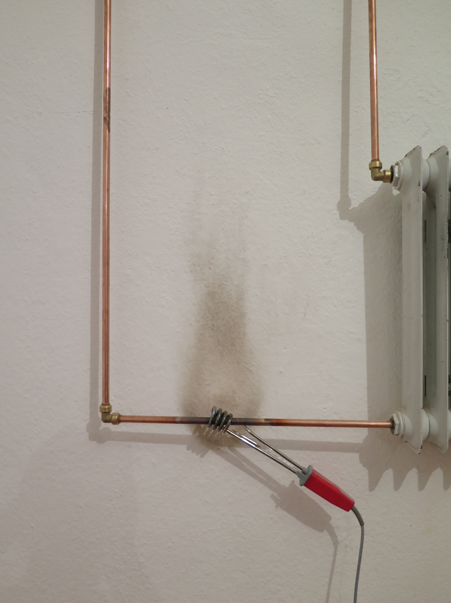

# Heizkörper

Date: 2014/11/01

Authors: [Rene Wagner](http://rene-wagner.tumblr.com)

---
---

Raum - Objekt - Funktion  
Ein Heizkörper kombiniert mit einem Tauchsieder - auf den ersten Blick ein thermischer Kreislauf.

Zunächst verbindet Rene Wagner Alltägliches mit Alltäglichem, aber bei genauerem Betrachten wird klar, dass die einzelnen Elemente in ihrem Sinngehalt eng verbunden sind. Die assoziativen Wärmequellen bilden das Fundament dieser Arbeit.

Die Spannung zwischen Form und Funktion, werden durch die Hängung des Werkes zusätzlich unterstrichen. Der Heizkörper und der Tauchsieder werden aus ihrem bekannten Kontext herausgenommen und vom Objekt zum Ausstellungsstück erhoben.

Die künstlerische Auseinandersetzung von dem Werk und der Umgebung verdeutlichen einen spielerischen Blick, welchen der Künstler Rene Wagner innerhalb doppelsinniger Verbindungen, zulässt.

Die Verortung der Ausstellung – ein ehemals bewohnter Raum – empfängt den Betrachter in einer bekannten Umgebung. Die Werke finden Sich in ihrer ursprünglichen Funktion in den meisten Alltagsräumen wieder, werden aber in dieser Arbeit entkontextualisiert, womit eine Auseinandersetzung mit der künstlerischen Installation generiert werden kann.

_Text: Saskia Meier_

