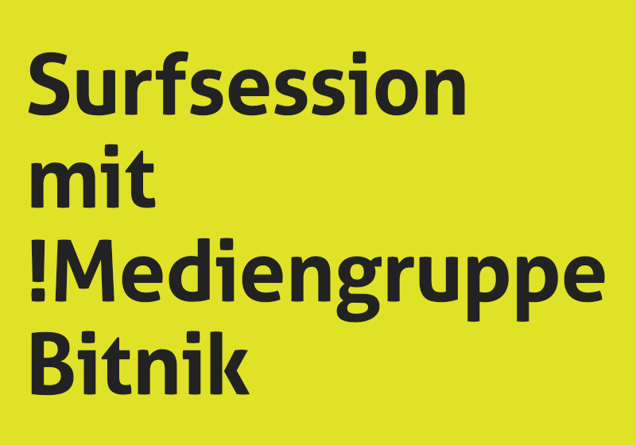

# Surfsession

## mit !Mediengruppe Bitnik

Ausgehend von ihrer jüngsten Arbeit «_Random Darknet Shopper_» führt die !Mediengruppe Bitnik auf eine Reise ins Darknet. Die Erkundung führt in verborgene Nischen des Internet, in Gebiete, die nicht von Suchmaschinen gefunden werden können. Dort findet sich eine Community, die sich absichtlich in den toten Winkeln von Suchmaschinen aufhält, sich austauschen, Handel treiben.

Wie funktioniert der Austausch und die Kommunikation in anonymen Netzwerken? Wie wird Vertauen aufgebaut? Wie ändern sich Konzepte von Identität in Netzwerken, in denen Eigenschaften wie die Lokalität zufällig vergeben werden? Wie sieht das Internet aus, wenn ich als Google-Bot oder als Chinese surfe?

Anders als im Surface Web, sind die meisten Services im Deepweb, oder dem Onionland wirklich global. Wie halten wir Konzepte von legal und illegal aufrecht, wenn diese Märkte diverse Rechtssysteme und Rechtsauffassungen miteinander verbinden?

### Weitere Links

- [Random Darknet Shopper](https://wwwwwwwwwwwwwwwwwwwwww.bitnik.org/r/)
- [Kunst Halle St. Gallen - «The Darknet. From Memes to Onionland»](http://www.kunsthallesanktgallen.ch/en/exhibitions/current.html)