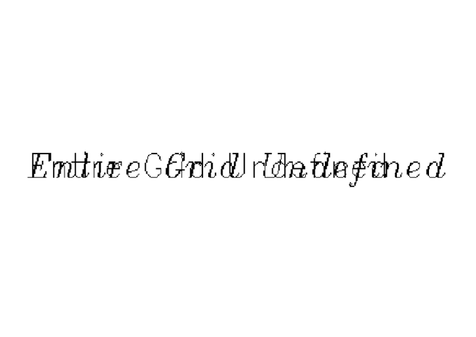
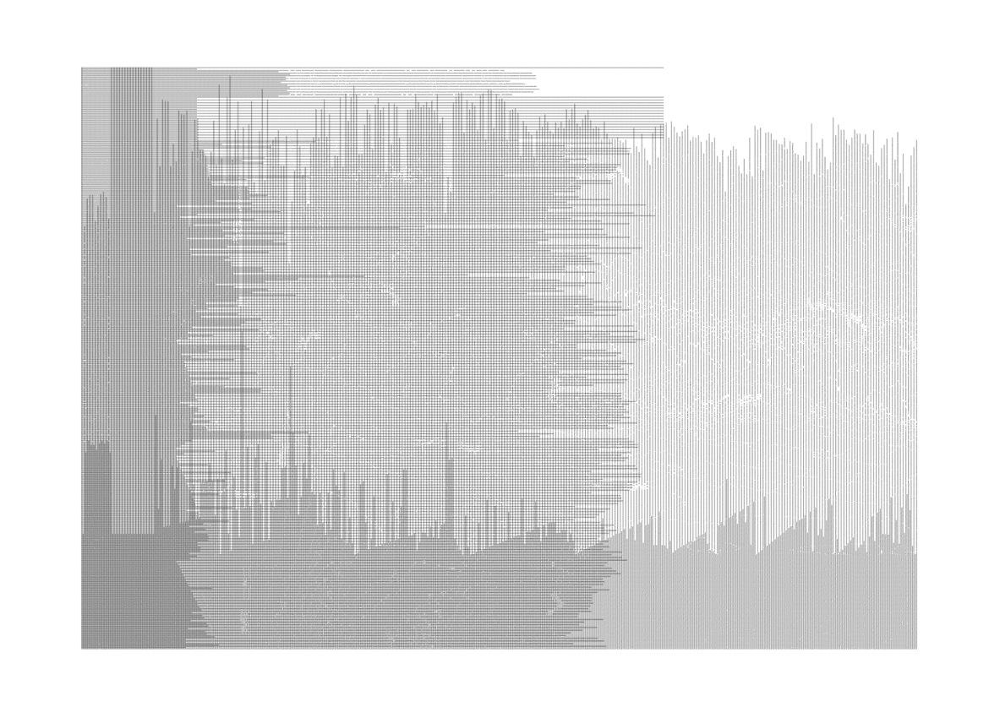
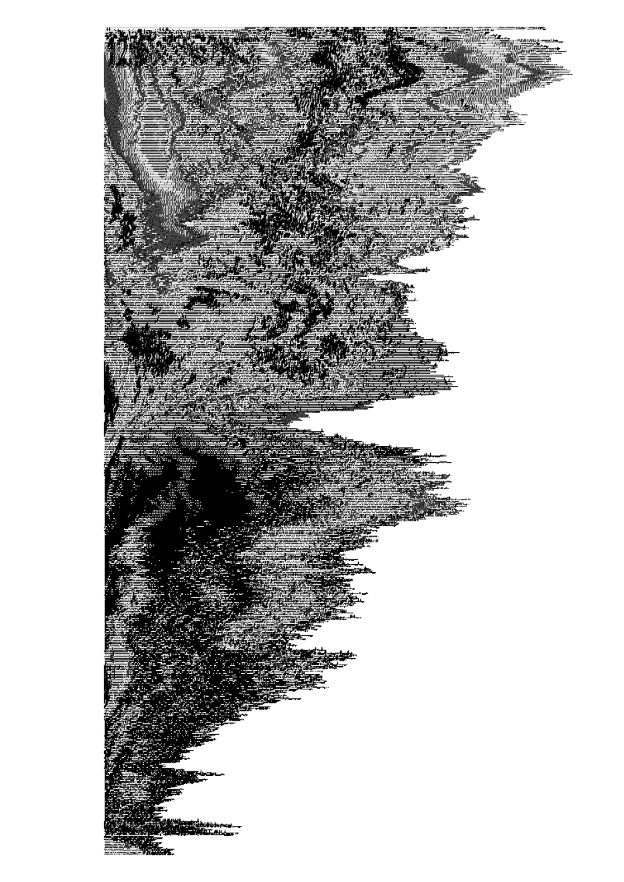

# Entire Grid Undefined

Date: 2015/01/01

Authors: Luise Matthes

---
---

  

Das ist ein topographischer Datenstapel. Eine Bestandsaufnahme der Hogesa-Demo in Köln vom 26.10.2014, unter Gesichtspunkten der Meteorologie, Thermik, Presse, Cloud.

201410261600.
  

<iframe src="//player.vimeo.com/video/116980243" width="500" height="375" frameborder="0" webkitallowfullscreen mozallowfullscreen allowfullscreen></iframe> 

  
