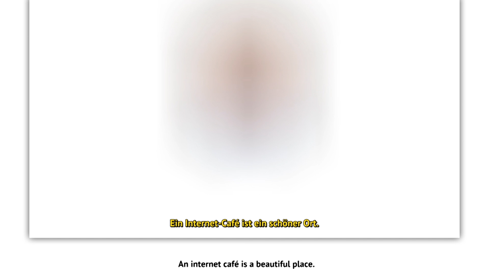

# Halit-Straße, Kassel, Hessen, Deutschland
Date: 01/01/2015
Authors: [Fritz Laszlo Weber](http://fritz-weber.de)

---
---

Ausgehend vom Mord an Halit Yozgat durch den NSU, wandert der Film entlang von Fragen und Forderungen nach dem Gedenken und der Sichtbarkeit in lokalen Kontexten und digitalen Netzwerken.
Halit Yozgat war Betreiber eines Internet-Cafés in der Kasseler Nordstadt, einem von Industrie und Arbeitsmigration geprägten Viertel. Im Internet wie im Stadtviertel kämpfen Angehörige und Aktivisten um Sichtbarkeit und Schreibrechte. 

Die Forderung nach der Umbenennung der Hauptstraße des Viertels in Halit-Straße 
verbindet den physischem Ort mit global verfügbaren, zirkulierenden Fotos, Kartenabbildungen und Satellitenaufnahmen. 
Den Anforderungen dieser Wirklichkeiten und wechselseitigen Abhängigkeiten begegnet der Film mit den Methoden und den Habitus, die durch das Nutzen digitaler Systeme und Kommunikation entstanden sind und versucht so formal, wie inhaltlich Gegenpositionen zu dominanten Narrativen zu entwerfen.

