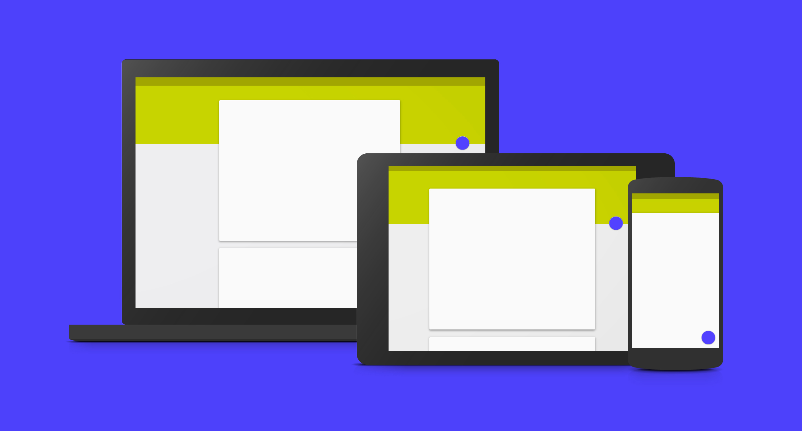

# Jedes Display braucht einen Interface Designer!

Date: 2015/02/01
Type: Workshop

---
---

## Workshop mit Christian Klotz

Interface Design beinhaltet mehr als nur die visuelle Schnittstelle – aber es ist kein schlechter Ausgangspunkt. Dieser einwöchige Workshop dreht sich ausschließlich um User Interface Design für Software. Welche Designprobleme existieren; technische Möglichkeiten und Limitierungen; Richtlinien und Konventionen für die Gestaltung? Dazu soll eine Benutzeroberfläche für ein allseits bekanntes Produkt neu erdacht werden. Im Verlauf der Woche wird der gesamte Prozess von der ersten Skizze über Wireframing, UI Design und Animation bis hin zum Prototyping durchlaufen.

_Dieser Kurs richtet sich nicht nur an Grafik-, Neue Medien- und ProduktdesignerInnen sondern alle sind willkommen und Programmierkenntnisse sind nicht erforderlich. Wenn möglich bitte eigene Geräte (Laptops, Tablets, Smartphones) mitbringen, ansonsten haben wir aber auch Geräte vor Ort._

### Weitere Links

- [christianklotz.co.uk](http://christianklotz.co.uk)