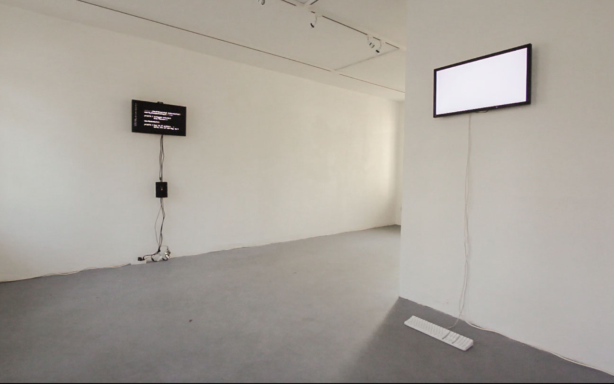
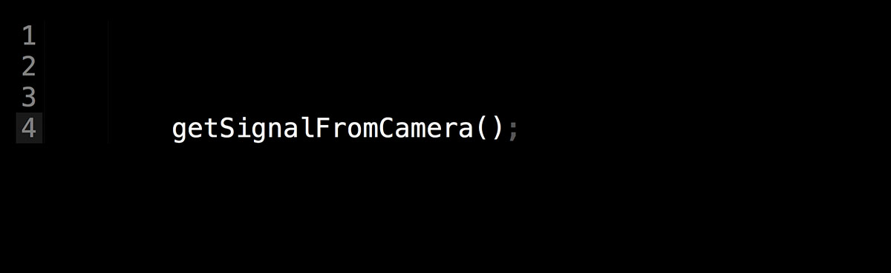

# useR

Date: 2015/03/01

Authors: [Isabel Paehr](http://www.isabelpaehr.de)

Keywords: useR, Textstelle, Kunsttempel Kassel

---
---

---

Im Eingangsbereich der Galerie hängen zwei Bildschirme. Der dunkle Screen, an den eine schwarze Platine angeschlossen ist, reagiert in Programmiersprache auf die Fragen des hellen Screens, der sich sprachlich in für die BesucherInnen gewohnter Weise ausdrückt. Der dunkle Screen kann auf das WLAN des Ausstellungshauses und die angeschlossene Webcam zugreifen. Er hackt Mailkonten von BesucherInnen, macht Fotos, veröfentlicht Kreditkartennummern, während der helle Screen Fragen nach Privatheit, Mensch-sein, Körperlichkeiten stellt. Trotzdem sieht sich der dunkle Screen nur aus Ausführer, als Maschine, die benutzt wird. Ein Dialog, in den die Besucher*innen gegen ihren Willen einbezogen werden, entsteht und vermischt die Grenzen zwischen dem, was wir für möglich halten und was bereits unsere sozial-technologische Realität ist.
  
---

---

Auszug aus der Performance (Screenshots):

---

'Textstelle' wurde im Februar 2015 in der Galerie 'Kunsttempel' in Kassel ausgestellt und war eine Zusammenarbeit der Künstlerinnen Freya Chakour (*Objects in mirror are closer than they appear*), Ida Lorbach (*Position 1*) und Isabel Paehr (*useR*).

---

