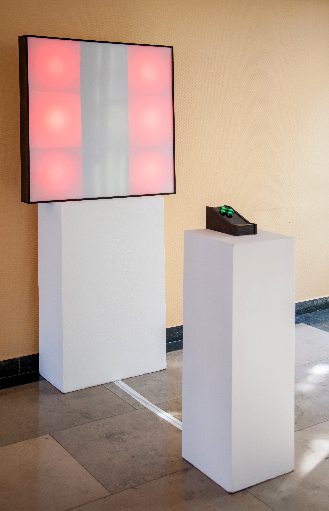
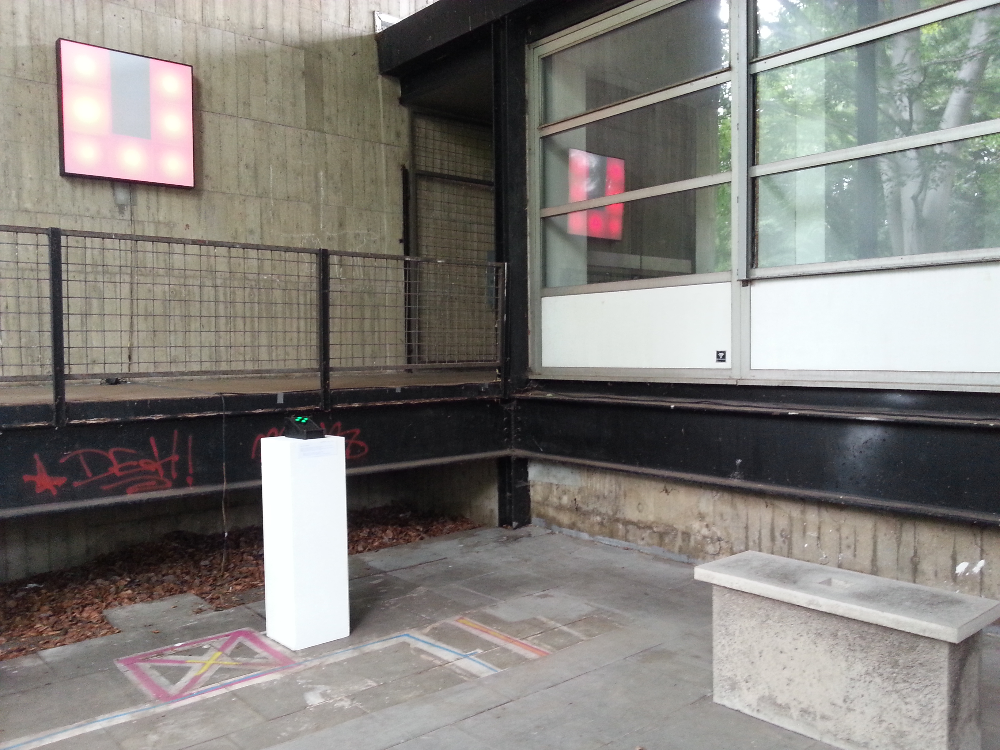

# Labyrinth

Date: 2015/04/22

Authors: [Leonard Bahro](http://leonardbahro.com), [Jasper Meiners](http://jaspermeiners.com)

Keywords: Labyrinth, Game,  Processing, Arduino, Holzfräse, LED-Technik

---
---

Labyrinth ist im Grunde nur eine Fläche aus 3 mal 3 Leuchtdioden, Pixeln. Spieler*innen können über die Arcade-Steuerung die Lichtmuster wie eine Karte aus der Draufsicht in alle vier Himmelsrichtungen verschieben.

__Prototyp im Workshop__

Dadurch entsteht intuitiv ein Effekt, der Hindernisse und Leeren erkennen lässt, es bilden sich Gänge. Trotz, oder gerade wegen, der Abstraktion dieses virtuellen Tunnelsystems können sich die Spieler*innen während des Spielens immer besser Wege und Muster merken. So entsteht eine Art Rausch, in dem alle möglichen Sackgassen abgerufen werden, bis das flackernde Ziel in Aussicht kommt, und das nächste System geladen wird.

Die Installation wird von einem Arduino betrieben und benötigt nur einen Anschluss an eine Steckdose, um zu funktionieren. Das Konzept entstand während eines Workshops und wurde zuerst durch einen Prototypen auf 3 mal 3 Zentimetern getestet.
Labyrinth war während eines Betrags der Reihe Kurzschluss zum Thema Videospiele und Kurzfilm von ARTE im Computerspielemuseum Berlin zu sehen und wurde im Regierungsprädisium Kassel während der Interventionen 2015 ausgestellt. 

__Ausstellung im Regierungspräsidium__
---

__Ausstellung beim Rundgang 2015__

---

__Interaktion beim Rundgang 2015 [Video]__