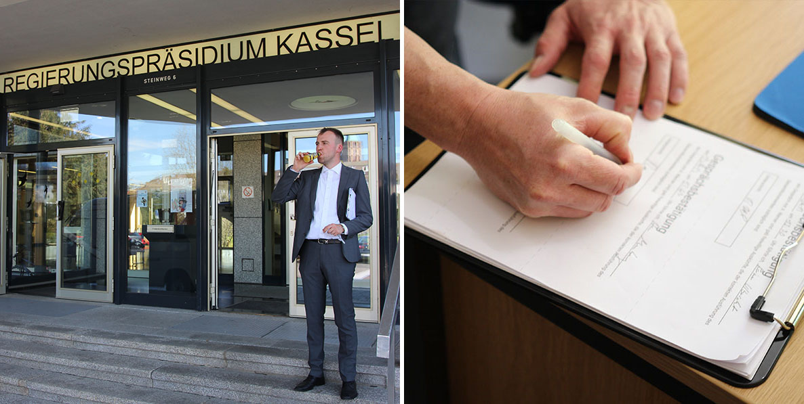
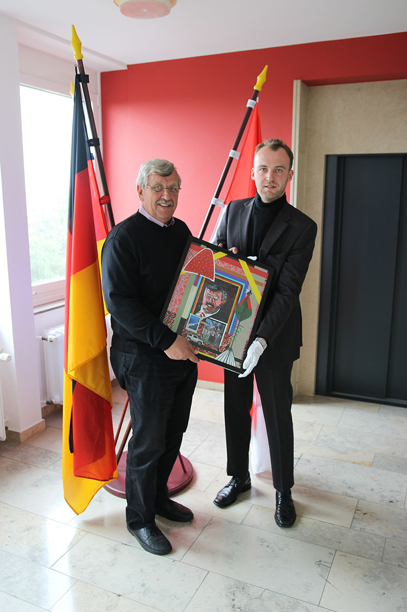

# Bürokratrie

Date: 2015/05/01

Authors: [Isabel Paehr](http://www.isabelpaehr.de)

---
---

Die Arbeit 'Bürokratrie' ist ein Eingriff in das System Regierungspräsidium Kassel und erforscht durch manuell eingesetzte Malware in Form von künstlerisch-aktivistischen Attacken die Beziehung eines hierarchisch strukturierten Apparates und der in ihm arbeitenden Menschen zur Kunst. 

Hierzu wurde das hierarchische, absolutistische und empathielose System 'Bürokratrie' geschaffen, 
welches aus dem Exekutor A. Werner, dessen Verhalten durch Skripte von der Künstlerin I. Paehr programmiert wurde, der Künstlerin selbst, die anonym blieb und nur über Formulare erreichbar war, dem Fotografen J. Lohrengel, künstlerischen Aktivist*innen und der Website [bürokratrie.de](http://www.bürokratrie.de) bestand. 

Die Website wurde genutzt, um live über Vorkommnisse im Regierungspräsidium zu informieren, Fotos und Videos der Aktionen zu zeigen, sowie Statements des Exekutors und die unangenehme Rhetorik der Bürokratrie zu verbreiten. 
  
---

---
Die MitarbeiterInnen erhielten zwischen dem 21.04 und dem 29.05.2015 wöchentlich Anweisungen, wie beispielsweise in Woche Eins die korrekte Installation eines vorgegebenen Bildschirmhintergrundes, der angebliche, provokative Statements des Kollegiums enthielt. 
Der Exekutor kontrollierte die Ausführungen und bestrafte durch einen Formulareintrag und die dokumentierte Anbringung roter Xe an den Türen der verweigernden Mitarbeiter*innen. Durch die Imitation von 'Symbolen' des Amtes wurden diese dekonstruiert und umgedacht: 
Der Anzug, das Formular, die Aufgabe.

Medienwirksam wurde die Bürokratrie, als sich empörte Angestellte an die lokale Presse wandten und im Anschluss die Onlineausgaben der [faz](http://www.faz.net/aktuell/rhein-main/kassel-isabel-paehrs-kunstaktion-buerokratrie-sorgt-fuer-aerger-13591520.html), welt, focus usw. berichteten.

Ausführlichere Dokumentationen der Aktionen finden sich auf:

auf der [Website von I.Paehr](http://www.isabelpaehr.com/buerokratrie.html)

& auf der Website der [Bürokratrie](http://www.buerokratrie.de)

& auf [Facebook](https://www.facebook.com/buerokratrie)

---

---
Fotografien: Josha Lohrengel 

Performance 'Der Exekutor' & Durchführung des Projektes in Kassel: Amadeus Werner 

Zeitweise Leitung des Dezernats für Aktivismus: A. Nikolic (Tattoo-Aktion) 

Dokumentation Film: K. Bannat (Xe, Einschluss RP), S. Güler (Tattoo-Aktion, Hahnvorführung Büro RP), F. Eggenwirth (Hahnentführung, Einschluss RP) 

Dokumentation Ton: L. Müller (Tattoo, Einschluss RP) 
AktivistInnen: L. Matthes, H. Drescher, I. Burcak (Alle: Tattoo-Aktion) 

Tattoo-Artist: B. Hahn.

Beratung, Kritik, Unterstützung: Hans Bernhard (Danke!)

---