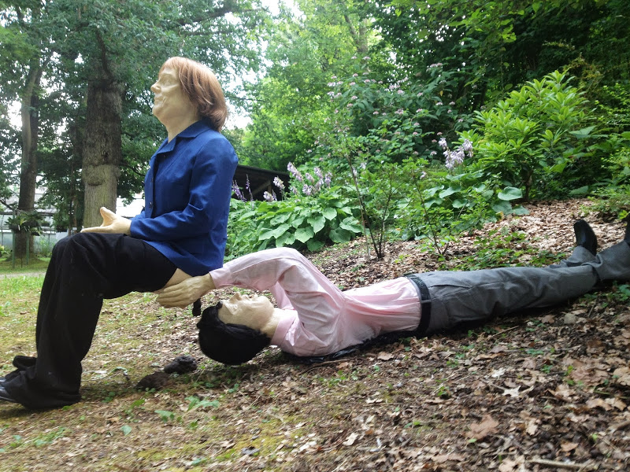

# Kunst und Aktion

Date: 2015/05/01
Type: Workshop

---
---

## Workshop mit Alexander Nikolic

Kunst ist meiner Meinung nach am spannendsten, wenn es ausserhalb der ihr zugestandenen Ghettos funktioniert, rezipiert wird, und wenn die Frage auftaucht, darf Kunst das, und ist das noch Kunst. Im Rahmen unseres Workshops werden wir und drei Tage lang, ausgiebig mit [SLUM-TV](http://www.slum-tv.org/) und [Boem*](http://boem.postism.org/) beschäftigen.

Projekten nahe am partizipativen Kunstbegriff, aber statt eines abgleiten in problematische paternalisierende Sozialarbeit und einer Ähstetisierung des Politischen, ein Abgleiten in den nicht weniger problematischen, aber dafür umso lustigeren Aktionismus. Jeden Tag sollen die Studenten auch ihre Projekte, Arbeiten darstellen, in Kurzform und vielleicht darüber sprechen, was Ihnen an Ihrer Arbeit problematisch erscheint, und was ihre aktionistische Perspektive sein könnte. Am letzten Tag des Workshops, werden kleine interne Präsentationen der Ergebnisse präsentiert. Skizzen, Pläne und vielleicht schon vorhande Projektideen.

### Weitere Links
 
- [FPÖ attackiert Slum-TV im Gemeiderat](http://www.youtube.com/watch?v=zXVkI1hwWT0)
 
- [Die Lizenz zum Beschissen werden](http://www.vice.com/alps/read/european-citizenship-die-lizenz-zum-beschissen-werden-alex-nikolic-michael-kalivoda-angela-merkel)

- [http://www.focus.de/kultur/kunst/umstrittene-skulptur-skandal-kunst-zeigt-angela-merkel-beim-toilettengang_aid_1045933.html](http://www.focus.de/kultur/kunst/umstrittene-skulptur-skandal-kunst-zeigt-angela-merkel-beim-toilettengang_aid_1045933.html)
 
- [Trailer einer performativen dokumentarischen Theaterarbeit](http://boem.postism.org/austrocalypse-now-trailer/)

Und natürlich auch alles was sich auf [malcolmxs.postism.org](http://malcolmxs.postism.org) und [boem.postism.org](http://boem.postism.org) finden lässt.