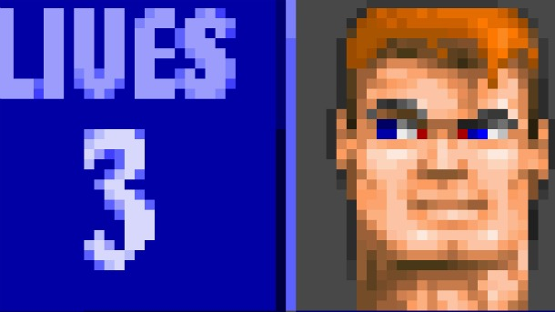

# Wolfenstein.HTML5 Game Modding

MaxWidth: 610px

---
---

## Workshop with JODI

The original Wolfenstein game was the first 1st person shooter in an open 3d game space.
From the beginning players were building tools to modify this game.
By the mid nineties, editors and tutorials could be downloaded from the internet.
DIY Game modification developed from simply adding more game maps to creating total conversions.
Since then Wolfenstein has been ported, deconstructed, simulated, hacked into many programming languages.
In the workshop we will use the latest rebuilt in HTML5 as a source for modifying this epic game.

- [wikipedia.org/wiki/Wolfenstein_3D](http://en.wikipedia.org/wiki/Wolfenstein_3D)
- [wolf3d.atw.hu](http://wolf3d.atw.hu/)

___JODI__ is a collective of two internet artists: Joan and Dirk. Since the mid-1990s they make original artworks for the web, they have shown and lectured world wide ;p_

### Read More

- [joid.org](http://joid.org)
- [wikipedia.org/wiki/Jodi](http://en.wikipedia.org/wiki/Jodi)