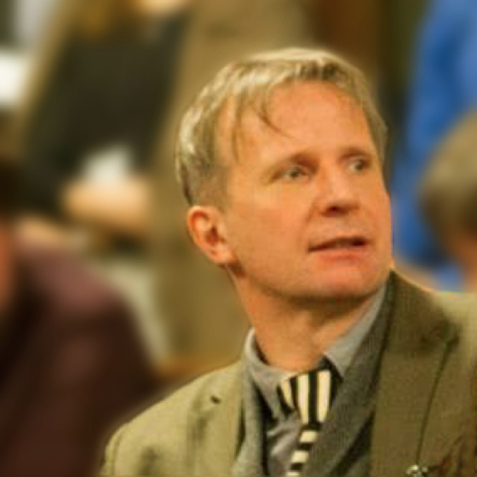

# Image Problems

Date: 2015/06/01

Authors: Stefan Lutschinger

Type: Workshop

---
---

Der Workshop bietet eine Einführung in aktuelle Diskurse rund um das Bild im Zeichen des Medienwandels, unseren Umgang mit Bildern und die Beschleunigung in den Bildermedien, das Verhältnis von Bild, Macht und Medien, das Medium Bild als Kommunikationsmittel und dessen Applikation in den globalen Massenmedien und Neuen Medien. Im Fokus stehen die neuen Probleme, vor die uns die Verlagerung der individuellen und gesellschaftlichen Kommunikation von der sprachlichen auf die visuelle Information, vom Wort auf das Bild, stellt.

_Mag. Stefan Lutschinger, Middlesex University, School of Media, London_

### Weitere Links

- [cybersalon.org](http://www.cybersalon.org)
- [classwargames.net](http://www.classwargames.net)