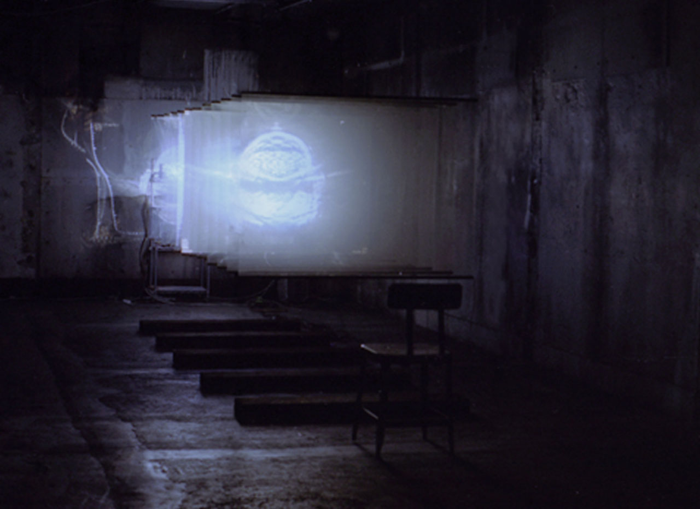

# SHIMURAbros

Date: 2015/06/01
Type: Workshop

---
---

## Workshop & Talk

SHIMURAbros are the sisterandbrother artist duo of Yuka and Kentaro Shimura, currently researchers at Studio Olafur Eliasson and exemplifying a new breed of Japanese contemporary artists. Working and exhibiting internationally, SHIMURAbros are known for incorporating elements of sculpture, installation and avant-garde filmmaking in their work. Film is the catalyst to all their
creations and the artists employ different techniques to each work. As an exploration of the history of moving images approached from a fundamentally different perspective extending film beyond its two-dimensional limit - their installations are an intricate and playful re-working of film and cinematic language.

___SHIMURAbros__ have exhibited widely including at Art Basel Hong Kong; 798 Art Factory; The National Art Centre, Tokyo; NUS Museum Singapore; MOCA (Museum of Contemporary Art Taipei); PICA(the Perth Institute of Contemporary Arts Museum), Australia; Museums Quartier, Vienna. "SEKILALA" received the Excellence Prize (Minister of Education, Culture, Sports, Science and Technology Prize) at the 13th Japan Media Arts Festival._

### Read More

- [shimurabros.com](http://www.shimurabros.com)