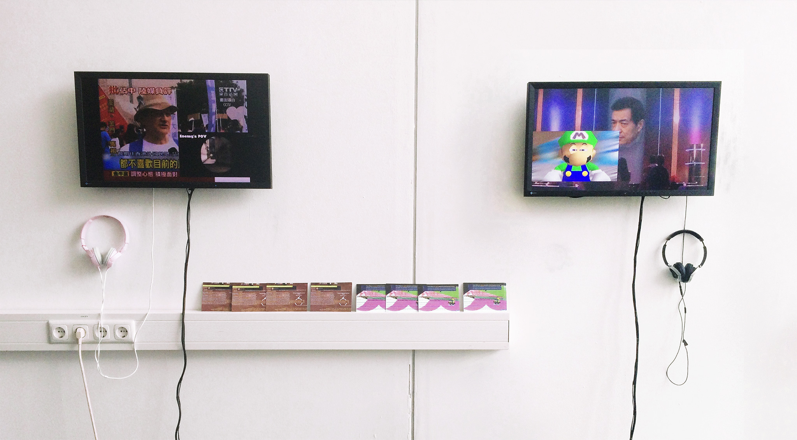

# Hong Kong love and peace

Date: 2015/07/09

Authors: [Echo Can luo](https://vimeo.com/user8116607)

Keywords: Hong Kong, Occupy Central with Love and peace

---
---

<iframe src="https://vimeo.com/155247531" width="500" height="281" frameborder="0" webkitallowfullscreen mozallowfullscreen allowfullscreen></iframe>

_Hong Kong love and peace_ is a video installation about the Hong Kong occupy Central with Love and peace(OCLP). OCLP, an advocacy group for universal suffrage in Hong Kong in 2014 using nonviolent civil disobedience.

The video collected the fragments of reports from various media and internet. It combined videos of violence with conflict with the CS online games.We always get a variety of  informations from the media reports. But it is difficult that we try to distinguish the fact from the information we received.  
Whether it is politics or games, are we involved in it?

